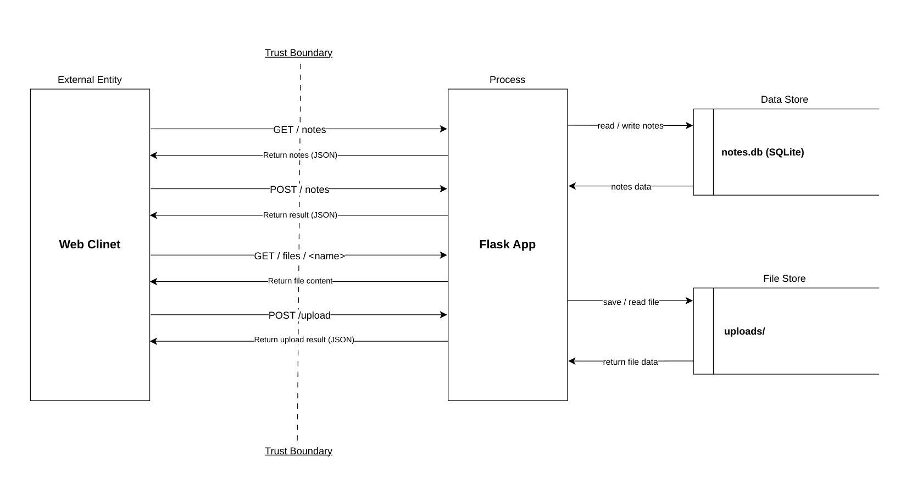

# Threat Model — <app name>

## 1. Data-flow diagram

## 2. Elements & trust boundaries
| Element                | Type (process/store/entity/flow) | Trust boundary crossed?                                    |
| ---------------------- | -------------------------------- | ---------------------------------------------------------- |
| Web client             | external entity                  | Yes — the request crosses from the Internet/external client into the application.|
| Flask app              | process                          | Yes — receives requests across the Internet → App boundary |
| SQLite DB (`notes.db`) | data store                       | No — internal to the application                           |
| `uploads/` store       | data store                       | No — internal to the application                           |

## 3. STRIDE analysis

### 3.1 `/notes`
| Category                       | Threat                                                                                                       |
| ------------------------------ | ------------------------------------------------------------------------------------------------------------ |
| **S** — Spoofing               | The client can set the `owner` value without authentication, allowing a user to pretend to be another user.  |
| **T** — Tampering              | The client can submit arbitrary `body` content, but the SQL query uses parameterized statements, which reduces SQL injection risk. |
| **R** — Repudiation            | There is no logging, so it is difficult to trace who created a note.                                          |
| **I** — Information Disclosure | `GET /notes` returns all notes without authentication or authorization.                                       |
| **D** — Denial of Service      | A client can send many requests to create notes and consume database or application resources.                |
| **E** — Elevation of Privilege | There is no role or permission model, so there is no clear privilege boundary.                                |

### 3.2 `/upload`
| Category                       | Threat                                                                                                       |
| ------------------------------ | ------------------------------------------------------------------------------------------------------------ |
| **S** — Spoofing               | There is no authentication, so the system cannot verify who is uploading the file.                            |
| **T** — Tampering              | The application uses the client-supplied `f.filename` directly when creating the save path, which may lead to unsafe file writes or arbitrary file write risks. |
| **R** — Repudiation            | There is no logging to record who uploaded a file, what file was uploaded, or when it happened.               |
| **I** — Information Disclosure | The response reveals the saved filename; if another version of the application returns the full resolved path, it could expose internal filesystem information. |
| **D** — Denial of Service      | There is no file-size limit or rate limit, so large or repeated uploads could consume disk space and system resources. |
| **E** — Elevation of Privilege | There is no authorization to restrict who is allowed to upload files.                                         |

### 3.3 `/files/<name>`
| Category                       | Threat                                                                                                       |
| ------------------------------ | ------------------------------------------------------------------------------------------------------------ |
| **S** — Spoofing               | There is no authentication, so the system cannot verify the identity of the requester.                        |
| **T** — Tampering              | The path traversal risk is lower than `/upload` because the application uses `send_from_directory()`.        |
| **R** — Repudiation            | There is no access logging, so the system cannot determine who accessed which file.                           |
| **I** — Information Disclosure | Anyone who knows the filename may be able to retrieve the file without authorization.                         |
| **D** — Denial of Service      | Repeated file requests could consume bandwidth and CPU resources.                                             |
| **E** — Elevation of Privilege | There is no authorization, but there is no clear direct privilege-escalation path in this endpoint.           |

## 4. Top 5 risks (likelihood × impact) + mitigation

| # | Threat                                                             | Likelihood | Impact | Risk Score | Mitigation                                                                             |
| - | ------------------------------------------------------------------ | ---------: | -----: | ---------: | -------------------------------------------------------------------------------------- |
| 1 | Elevation of Privilege via client-controlled `role` in `/register` |          5 |      5 |     **25** | Do not accept `role` from the client; force new users to `user`                        |
| 2 | Unauthorized note access in `/api/notes/<id>`                      |          5 |      4 |     **20** | Verify that the note owner matches the authenticated user                              |
| 3 | SQL Injection risk in `/search`                                    |          4 |      5 |     **20** | Replace string-built SQL with parameterized queries                                    |
| 4 | Command Injection risk in `/export`                                |          4 |      5 |     **20** | Avoid `shell=True`; use fixed arguments / allowlist export formats                     |
| 5 | Weak authentication/session security                               |          4 |      4 |     **16** | Use strong password hashing, secure JWT/session configuration, and secure cookie flags |
