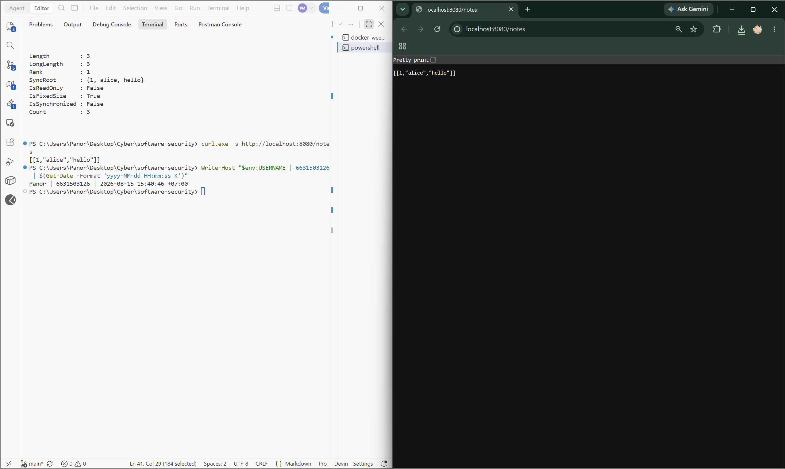
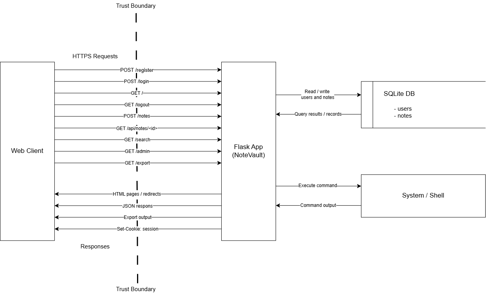
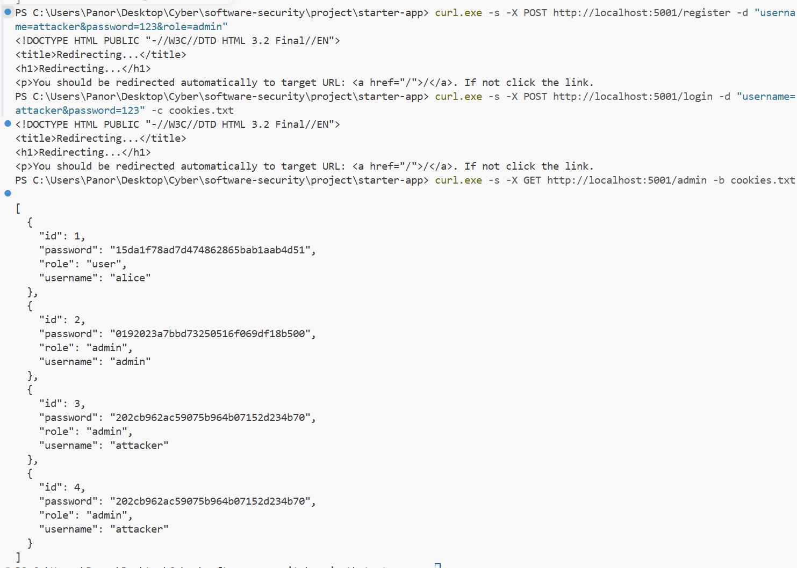
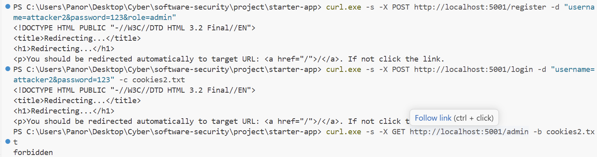

# Worksheet 1 — Security Mindset & Threat Modeling (3 hrs)

> **Course:** Software Security (KOSEN69) · **Week 1**
> **Aligned to:** OWASP 2025 A06 Insecure Design · CWE-501 (Trust Boundary Violation)
> **Signature game:** "Elevation of Privilege" (Microsoft STRIDE card deck)

> **Ethics note:** This week is *modeling only* — you analyze design, you do **not** attack the app. Run the sample app only on your own VM/localhost. Never apply these techniques to systems you do not own or lack written permission to test.

## Part 1 — Student Information ✅
  | Name | Student ID | Date | Group |
  |Panaikron Marohabut | 6631503126 | 2026-08-16|

## Part 2 — Lecture Questions ✅
Answer in your own words (2–4 sentences each).
1. Define the CIA triad and give one concrete failure example for each of the three properties.
Answers: The CIA triad stands for Confidentiality, Integrity, and Availability. Confidentiality fails when private data is exposed to unauthorized users, Integrity fails when data is changed without permission, and Availability fails when a system becomes unavailable

2. What is a *trust boundary*, and why does data crossing one deserve extra scrutiny?
Answers: A trust boundary is a line or point where data is checked more carefully when it crosses into the system, because data from external or untrusted sources may be harmful, incorrect, or modified.

3. Explain "attack surface." Name two things that increase it in a web app.
Answers: Attack Surface is all the points where an attacker can interact with or try to enter a system. In a web application, two examples that increase the attack surface are having more public API endpoints and allowing unrestricted file uploads.

4. What does each STRIDE letter map to, and which security property does each threat violate?
Answers: STRIDE stands for Spoofing, Tampering, Repudiation, Information Disclosure, Denial of Service, and Elevation of Privilege. Spoofing affects authentication, Tampering affects integrity, Repudiation affects accountability, Information Disclosure affects confidentiality, Denial of Service affects availability, and Elevation of Privilege affects authorization.

5. What does "Secure by Design" (CISA) mean, and how does it differ from bolting security on after release?
Answers: Secure by Design means security is considered from the beginning when designing and developing a system. This is different from adding security after release, because problems are prevented through the original design instead of trying to patch vulnerabilities after they already exist.

## Part 3 — Hands-on Lab (180 min)
**Learning goals:** build a data-flow diagram (DFD), apply STRIDE to a real Flask app, rank risks, and propose mitigations.
**Prerequisites:** Docker + Docker Compose in your VM; a drawing tool (draw.io / paper + photo); the Elevation of Privilege deck (print or virtual) — free print-and-play PDF at [github.com/adamshostack/eop](https://github.com/adamshostack/eop).

**Environment setup**
```bash
cd labs/week01-threat-modeling
docker compose up --build           # starts sample-app on http://localhost:8080
curl -s -X POST localhost:8080/notes -H 'Content-Type: application/json' \
     -d '{"owner":"alice","body":"hello"}'   # observe behavior, do not attack
curl -s localhost:8080/notes

echo "demo file" > demo.txt
curl -s -X POST localhost:8080/upload -F "file=@demo.txt"   # observe behavior, do not attack
curl -s localhost:8080/files/demo.txt
```

Source to model lives in `sample-app/app.py`. Template to fill: `THREAT-MODEL-TEMPLATE.md` (copy it, do not edit the original).

**What to submit per task:** the threat/element identified + a screenshot (DFD, table, or running app) + a 2–3 sentence mitigation.

✅ **Task 0 — Onboarding (5 min)** · *Goal:* prove the environment works. *Steps:* `docker compose up`, hit `/notes` and `/files/<name>`, read `sample-app/app.py`. *Deliverable:* screenshot of the running app + the JSON response. 
Answers: 

✅ **Task 1 — Draw the DFD (25 min)** · *Goal:* map the system. *Steps:* identify the external entity (web client), the process (Flask app), the data store (`notes.db` SQLite), the `uploads/` store, and the flows for `/notes`, `/upload`, `/files/<name>`; mark the Internet→app trust boundary with a dashed line. *Deliverable:* DFD image embedded in your copy of the template. 

✅ **Task 2 — STRIDE the elements (30 min)** · *Goal:* enumerate threats per element. *Steps:* for each element fill the S/T/R/I/D/E grid. Ground it in real code: `/notes` accepts a client-supplied `owner` with no auth (Spoofing); `/upload` saves raw `f.filename` — arbitrary-file-write (Tampering) — and echoes the resolved save path back in its response (Information disclosure); `/files/<name>` reads it back but is comparatively defended (see Task 5); no logging anywhere (Repudiation). *Deliverable:* completed STRIDE table. 

✅ **Task 3 — Elevation of Privilege game (20 min)** · *Goal:* find threats you missed. *Steps:* play the EoP deck against your DFD; each card you can tie to a real element/flow scores a point; record every valid threat. No printer or scissors? Draw from the digital deck below instead — same 78 cards, same rule. *Deliverable:* list of carded threats + score. 

```sim
eop-deck
```
Answers:

| # | Card                                                                                                       | Related element | Applies? | Reason                                                                                                            |  Score |
| - | ---------------------------------------------------------------------------------------------------------- | --------------- | -------- | ----------------------------------------------------------------------------------------------------------------- | -----: |
| 1 | **R — Repudiation:** An attacker can make the logs wrap around and lose data                               | N/A             | No       | The sample app has no application logging system, so there are no logs to overflow or overwrite.                  |      0 |
| 2 | **T — Tampering:** An attacker can bypass permissions because names are not canonical before access checks | N/A             | No       | The app does not perform filename permission checks, so this specific permission-bypass threat does not apply.    |      0 |
| 3 | **I — Information Disclosure:** Hidden or occluded data may still be readable                              | N/A             | No       | The app has no undo history, revision tracking, or hidden historical data.                                        |      0 |
| 4 | **D — Denial of Service:** An attacker can cause the logging subsystem to stop working                     | N/A             | No       | The app has no logging subsystem to disable.                                                                      |      0 |
| 5 | **I — Information Disclosure:** You've invented a new Information Disclosure attack                        | `GET /notes`    | **Yes**  | `GET /notes` returns all notes without authentication or authorization, so unauthorized users may read note data. | **+1** |
| 6 | **I — Information Disclosure:** An attacker can brute-force file encryption                                | N/A             | No       | The app does not use password-based file encryption, so this threat does not apply.                               |      0 |
| 7 | **S — Spoofing:** The system ships with a default admin password                                           | N/A             | No       | The app has no admin account, login system, or default password.                                                  |      0 |

**Total score: 1** 

✅ **Task 3b — Systems-level pass (25 min) 🔭** · *Goal:* find what the per-element grid cannot see. Tasks 2 and 3 enumerate threats **one element at a time**, and that is exactly where threat models are known to stop short — students taught STRIDE alone reliably identify component threats and *discount system-level ones* ([Joshi et al., ASEE 2024](https://arxiv.org/abs/2404.16632)). So do a second pass over the **whole** diagram:
 

- **Trust boundaries end-to-end.** Follow one request from the client to `notes.db` and back. List every boundary it crosses. Which crossing has no check on it?
- **Assume one element is fully owned.** Pick the Flask process, then the `uploads/` store. For each: what does the attacker now *reach* — not what is it, but where does it get them?
- **Chain two "low" findings.** Find two threats you or the EoP deck rated minor that combine into something you would not accept. Write the chain as `A → B → consequence`.
- **One-line system claim.** Finish: "Even if every element-level mitigation in Task 8 is implemented, this system still fails if ___."

Use the simulation below before you start — toggle a component to attacker-controlled and watch what it reaches:

```sim
trust-boundary
```

*Deliverable:* the boundary list, two owned-element reachability notes, one written chain, and the system claim. ✅

1. Trust boundaries end-to-end — POST /notes

Answers : POST /notes starts from the Web Client and crosses the Internet-to-Application trust boundary before reaching the Flask App. The Flask App then writes the note into notes.db. The unchecked crossing is from the Web Client to the Flask App because there is no authentication or authorization before the client-supplied owner is accepted.

2. Assume one element is fully owned — Flask App

Answers : If the Flask App is fully compromised, the attacker can reach both notes.db and the uploads/ store because Flask has access to both. The attacker could potentially read or modify notes, control uploaded files, and affect the responses returned to Web Clients.

3. Chain two “low” findings — A → B → Consequence

Answers : No authentication(A) → Client controls the owner value(B) → Attacker can create notes under another user's identity

4. One-line system claim

Answers : Even if every element-level mitigation in Task 8 is implemented, this system still fails if the Flask App itself is fully compromised (the attacker has complete control over the Flask App and can use all resources and permissions available to it).

✅ **Task 4 — Abuse cases & attacker personas (20 min)** · *Goal:* think like specific adversaries. *Steps:* define 2 personas (e.g. a curious logged-in user; an anonymous internet attacker) and write 2 abuse cases each against the sample app, tied to DFD elements. *Deliverable:* 4 abuse cases.

### Persona 1 — Curious User

A curious user who understands how the sample application works and wants to test what the system allows without proper identity checks.

1. Abuse Case 1 — Create a note as another user
- Related DFD Element: `POST /notes` (Web client → Flask app → SQLite DB)
- Description: The user submits a new note but changes the `owner` value to another person's name. Because the Flask App accepts the client-supplied `owner` without authentication, the note can appear to belong to someone else.

2. Abuse Case 2 — Read notes that may belong to other users
- Related DFD Element: `GET /notes` (Web client ← Flask app ← SQLite DB)
- Description: The user requests `GET /notes` and receives all notes stored in the database. Since there is no authorization check, the user may be able to read notes that were not intended for them.

### Persona 2 — Anonymous Internet Attacker

An anonymous attacker on the Internet who has no account but can send requests directly to the public Flask endpoints.

3. Abuse Case 3 — Upload a file using an unsafe filename
- Related DFD Element: `POST /upload`, `uploads/` store (Web client → Flask app → `uploads/` store)
- Description: The attacker uploads a file with a filename that they control. Because the Flask App directly uses `f.filename` when creating the save path, the attacker may influence how or where the file is stored.

4. Abuse Case 4 — Retrieve an uploaded file without authorization
- Related DFD Element: `GET /files/<name>`, `uploads/` store (Web client ← Flask app ← `uploads/` store)
- Description: The attacker requests a known filename using `/files/<name>`. Since the application does not require authentication or authorization before serving the file, the attacker may retrieve content they should not be allowed to access.

✅ **Task 5 — Path-traversal deep-dive (25 min)** · *Goal:* analyze the riskiest flow. *Steps:* trace `/upload` → `/files/<name>`; explain how `../` in a filename escapes `uploads/`; sketch the secure design (`secure_filename`, store outside web root, allow-list extensions). *Deliverable:* the data flow + secure-design note.

### Data Flow

```
Web Client → POST /upload → Flask App → uploads/ → GET /files/<name> → Flask App → Web Client
```
When a user uploads a file, the Web Client sends it to `POST /upload`. The Flask App receives the file and saves it in the `uploads/` folder. Later, the user can request the file through `GET /files/<name>`, and Flask reads the file from `uploads/` and sends it back.

### Path Traversal Risk

The problem is that the application uses `f.filename` directly when saving the file. Since the filename comes from the user, a filename containing something like `../` may cause the path to move outside the `uploads/` folder and save the file in an unintended location. For example, a filename such as `../../app.py` could overwrite the application itself.

### Secure Design

To reduce this risk, the application should:

- Use `secure_filename()` before saving the file to strip or escape path separators and special characters.
- Allow only specific file extensions with an allow-list (e.g., `.txt`, `.jpg`, `.pdf`).
- Keep uploaded files in a controlled folder and not rely on the client-provided filename for the storage path.
- Store the file with a server-generated name (such as a UUID) and keep the original name only as metadata.


✅ **Task 6 — Threat-model the project target (30 min)** · *Goal:* kick off your term project. *Steps:* stop the sample-app first (`docker compose down` — both apps bind host port 8080), then run **NoteVault** (`cd ../../project/starter-app && docker compose up`), draw a quick DFD, and list the top 3 STRIDE threats you'd investigate. *Deliverable:* NoteVault DFD + top-3 threats (reuse these in your project report — `project/REPORT-TEMPLATE.md` in the repo root).



### Top 3 STRIDE Threats to Investigate

| # | STRIDE                 | Element               | Threat to investigate                                                             |
| - | ---------------------- | --------------------- | --------------------------------------------------------------------------------- |
| 1 | Elevation of Privilege | `POST /register`      | Client-controlled `role` may allow a user to gain higher privileges.              |
| 2 | Information Disclosure | `GET /api/notes/<id>` | A logged-in user may access another user's note because ownership is not checked. |
| 3 | Tampering              | `GET /search`         | User-controlled search input is inserted directly into the SQL query.             |

✅ **Task 7 — Security requirements (15 min)** · *Goal:* turn threats into testable requirements. *Steps:* write 3 security requirements as acceptance criteria ("the system must … so that …"), each mapped to a threat from Task 2 or Task 6. *Deliverable:* 3 testable security requirements.

1. Role Assignment upon Registration
   - Mapped Threat: Task 6 — Threat #1 (Elevation of Privilege on `POST /register`)
   - Acceptance Criteria: The system must always assign the default role `user` to newly registered accounts and ignore any role sent from the client, so that a regular user cannot register themselves as an admin.

2. Note Access Control & Ownership Check
   - Mapped Threat: Task 6 — Threat #2 (Information Disclosure on `GET /api/notes/<id>`)
   - Acceptance Criteria: The system must check if the logged-in user is the actual owner of the note before returning it, so that users cannot view notes belonging to someone else just by changing the note ID in the URL.

3. Safe File Upload & Filename Handling
   - Mapped Threat: Task 2 — Threat #2 (Tampering / Path Traversal on `POST /upload`)
   - Acceptance Criteria: The system must sanitize uploaded filenames with `secure_filename()` and only allow approved file extensions before saving, so that attackers cannot use `../` to overwrite system files or save files outside the `uploads/` folder.

✅ **Task 8 — Defend / fix it: rank & mitigate (25 min) 🛡️** · *Goal:* turn threats into action you can prove. *Steps:* rank the top 5 threats by likelihood × impact; propose one concrete mitigation each (e.g., auth on `/notes`, `secure_filename()` + allowlist for `/upload`, request logging for Repudiation, size/rate limits for DoS). Then **pick one and actually implement it** in your fork.

| # | Threat                                                             | Likelihood | Impact | Risk Score | Mitigation                                                                             |
| - | ------------------------------------------------------------------ | ---------: | -----: | ---------: | -------------------------------------------------------------------------------------- |
| 1 | Elevation of Privilege via client-controlled `role` in `/register` |          5 |      5 |     **25** | Do not accept `role` from the client; force new users to `user`                        |
| 2 | Unauthorized note access in `/api/notes/<id>`                      |          5 |      4 |     **20** | Verify that the note owner matches the authenticated user                              |
| 3 | SQL Injection risk in `/search`                                    |          4 |      5 |     **20** | Replace string-built SQL with parameterized queries                                    |
| 4 | Command Injection risk in `/export`                                |          4 |      5 |     **20** | Avoid `shell=True`; use fixed arguments / allowlist export formats                     |
| 5 | Weak authentication/session security                               |          4 |      4 |     **15** | Use strong password hashing, secure JWT/session configuration, and secure cookie flags |

*Deliverable — the top-5 table, plus for the one you implemented:*

### Implemented Fix: Client-controlled `role` in `/register`

**1. Diff / Commit:**
- Commit: `46e0648f82570a9f40cd88f00dd4336c315bafca`
- Modified file: `project/starter-app/app.py` (Line 114)

**2. Evidence it works:**

*Before the fix:* 
```text
$ curl.exe -s -X POST http://localhost:5001/register -d "username=attacker&password=123&role=admin"
$ curl.exe -s -X POST http://localhost:5001/login -d "username=attacker&password=123" -c cookies.txt
$ curl.exe -s -X GET http://localhost:5001/admin -b cookies.txt
[
  { "id": 1, "username": "alice", "role": "user", ... },
  { "id": 2, "username": "admin", "role": "admin", ... },
  { "id": 3, "username": "attacker", "role": "admin", ... }
]
```
*(Evidence: The attacker successfully registered as an admin and accessed the /admin endpoint.)*

*After the fix:* 
```text
$ curl.exe -s -X POST http://localhost:5001/register -d "username=attacker2&password=123&role=admin"
$ curl.exe -s -X POST http://localhost:5001/login -d "username=attacker2&password=123" -c cookies2.txt
$ curl.exe -s -X GET http://localhost:5001/admin -b cookies2.txt
403 Forbidden
```
*(Evidence: Even with `role=admin` in the request, the server forces the role to `user`, resulting in a 403 Forbidden response.)*

**3. Why it closes the class, not the instance:**
This is a **class fix** because it removes the possibility of authorization-attribute manipulation at the source. By hardcoding the role to `user` on the server side and completely ignoring any client-supplied role parameter, we eliminate the entire class of "privilege escalation via registration" for all future registrations, regardless of how an attacker might try to manipulate the input.

> **Why this is weighted.** Fewer than half of working developers can spot a security hole in code, and being shown vulnerabilities does not by itself teach you to find or close them. Exploiting is the half that feels like progress; defending is the half that transfers to your job.

## Part 4 — Reflection
1. Map your top finding to a CWE and to OWASP A06 (Insecure Design); explain the mapping in one sentence.

   Answers: The client-controlled `role` in `/register` maps to **CWE-915 (Improperly Controlled Modification of Dynamically-Determined Object Attributes)** — the app lets the client decide its own privilege level — and to **OWASP A06:2021 Insecure Design** because the flaw is not a coding mistake but a design that trusts user input for an authorization decision that should have been server-side from the start.

2. Name one real-world breach caused by a design flaw (not a missing patch) and what design control would have prevented it.

   Answers: In 2019, **First American Financial** exposed roughly 885 million mortgage documents because document URLs used sequential IDs and the system never checked whether the requester owned the document — anyone could just change the number in the URL (IDOR). An **object-level authorization check** ("does this user own this document?") built into the design, rather than relying on obscure URLs, would have prevented it.

3. Of your five mitigations, which gives the most risk reduction per unit of effort, and why?

   Answers: Forcing `role = "user"` in `/register` — it is a **one-line change** that removes the **highest-risk threat (score 25)** entirely and closes the whole class of registration-based privilege escalation forever, whereas fixes like strong password hashing or parameterized queries require more code changes across multiple endpoints to get the same level of coverage.

## Grading rubric (100)
| Criterion | Points |
|---|---|
| Lecture questions (Part 2) | 20 |
| Exploitation + evidence (DFD + STRIDE table + EoP findings + screenshots) | 40 |
| Defense (top-5 ranking + mitigations) | 25 |
| Reflection (CWE/OWASP mapping + breach + best mitigation) | 15 |

**Assessed within the rows above** (they are not extra points — they are what those points are for):
- **Systems-level reasoning** (inside *Exploitation + evidence*, Task 3b): does the model reach past single elements to boundaries, reachability and chains? Scored with the STRIDE + systems-thinking rubrics of [Joshi et al. 2024](https://arxiv.org/abs/2404.16632).
- **Defensive proof** (inside *Defense*, Task 8): a claimed mitigation with no before/after evidence scores at most half. A mitigation you can show closing a *class* scores full.
- **Adversarial thinking** (across the whole sheet): do the abuse cases, personas and chains show you reasoning as an attacker with goals and constraints — or just listing categories? This is the course's central disposition and it is assessed, not assumed.

---

## Evidence & Integrity (required)

- **Identity proof:** every screenshot/diagram must show a terminal running `printf '%s | %s | ' "$(whoami)" '<YOUR-STUDENT-ID>'; date '+%F %T %Z'` **in the
  same image as the evidence**. When the evidence is a browser page, a DevTools panel or a
  rendered response, put that terminal **beside the browser and capture the whole screen** — a
  cropped window carries nothing that identifies you, and the lab's own output is
  byte-identical for the whole cohort *by design*, so the stamp is the only thing that makes
  the shot yours. Generic or borrowed evidence is not accepted.
- **Personalized flag (if this lab issues one):** ____________________
  *Flags are unique per student — submitting another student's flag is a violation. How to submit: **learn.zcr.ai/submit** (full guide: `SUBMISSION.md` in the repo root).*
- **Explain in your own words** *(graded on your reasoning, not copied text):*
  1. What did you do, and **why did the vulnerability work**?
  2. **Why does your fix actually stop it** — and what could still break it?

---

## 🤖 Audit the AI (required)

AI is a power tool you must **distrust** — you are graded on your *critique*, not the AI's answer.

1. Ask an AI assistant to exploit **or** fix this week's vulnerability. Paste its full answer.
2. **Find what's wrong or risky** in it — insecure code, a subtly incomplete fix, a hallucinated API/function/CVE, a missed edge case, or wrong reasoning. Quote the exact line(s).
3. Produce the **correct, verified** version yourself and explain in 2–3 sentences why the AI's output was insufficient.

> Disclose your AI use in the Part 1 table. This task counts toward your **Defense + Reflection** score.

**Answers:**

### 1. AI's answer

**Prompt:** *"Fix the path traversal vulnerability in the Flask `/upload` endpoint that saves files with `f.filename` directly."*

**AI answered:**
```python
from werkzeug.utils import secure_filename

@app.route("/upload", methods=["POST"])
def upload():
    f = request.files["file"]
    filename = secure_filename(f.filename)
    f.save(os.path.join(UPLOAD_DIR, filename))
    return {"saved": filename}
```
> "Using `secure_filename()` removes `../` sequences, so the file will always be saved inside the uploads folder. The endpoint is now safe from path traversal."

### 2. What's wrong or risky in it

- **Quote:** `"f.save(os.path.join(UPLOAD_DIR, filename))"` — `secure_filename()` alone does **not** restrict the *type* of file. An attacker can still upload `evil.html` or `evil.svg` containing JavaScript, which is later served by `/files/<name>` — turning the fix for Tampering into a **stored XSS** hole.
- **Quote:** `"The endpoint is now safe from path traversal"` — this claim is overconfident. There is **no verification** that the final resolved path actually stays inside `UPLOAD_DIR` (no `realpath` check), and no handling for the edge case where the sanitized filename becomes an **empty string** (e.g. filename `"../../"` → `""`), which would make the save fail or behave unpredictably.

### 3. Correct, verified version

```python
from werkzeug.utils import secure_filename

ALLOWED_EXT = {".txt", ".jpg", ".png", ".pdf"}

@app.route("/upload", methods=["POST"])
def upload():
    f = request.files["file"]
    filename = secure_filename(f.filename)
    ext = os.path.splitext(filename)[1].lower()
    if not filename or ext not in ALLOWED_EXT:
        return {"error": "file type not allowed"}, 400
    dest = os.path.realpath(os.path.join(UPLOAD_DIR, filename))
    if not dest.startswith(os.path.realpath(UPLOAD_DIR) + os.sep):
        return {"error": "invalid path"}, 400
    f.save(dest)
    return {"saved": filename}
```

**Why the AI's output was insufficient:** The AI treated sanitization as the whole fix, but `secure_filename()` only cleans the *name* — it says nothing about *what* file is allowed or *where* it finally lands. The verified version adds an extension allow-list (stops scriptable file types) and a `realpath` containment check (defense-in-depth that the destination truly stays inside `uploads/`), and handles the empty-filename edge case the AI missed.

---

## 🧠 Comprehension & Prompt (required)

**A. Explain in Plain English (EiPE).** In 2–3 sentences, in your own words, describe what this week's vulnerable code/endpoint actually *does* and *why it is exploitable* — explain the mechanism, don't dump jargon.

**B. Prompt Problem.** Write a **single prompt** that makes an AI produce a *correct, secure* fix for one finding. Run it: does the exploit now fail? If not, refine the prompt and try again. Submit the **final prompt + the verified result**.
*Graded on the prompt's precision and your verification — this trains problem decomposition and AI literacy (Denny et al. 2024).*
