# Worksheet 2: Secure SDLC & Tooling

| Course | Software Security (KOSEN69) |
|---|---|
| Week | 2 |
| Duration | 3 hours |

> **Aligned to:** OWASP 2025 (A05 Injection [CWE-89, CWE-78], A04 Cryptographic Failures [CWE-327], A02 Security Misconfiguration [CWE-798, CWE-489]) · CWE-798, CWE-89, CWE-78, CWE-327, CWE-489
> **Signature game:** "Bug Triage Race" (scan → triage; score = true positives − misclassified)

> **Ethics note:** The scanners run only against the provided `vulnerable-repo/` on your own machine. Do not point SAST/secret scanners at third-party repos or production systems without authorization. Treat any secret you find here as fake lab data.

## Part 1 — Student Information

| Name | Student ID | Date | Group |
|---|---|---|---|
| Panaikron Marohabut | 6631503126 | 2026-09-03 | |

## Part 2 — Lecture Questions

Answer in your own words (2–4 sentences each).

1. Distinguish SAST, DAST, and SCA — what does each see, and when in the SDLC does each run?

  **Answer:** SAST analyzes source code without running the application and can be used in the Code phase. DAST tests a running application from the outside and is usually used in the Test/Deploy phase. SCA scans dependencies and third-party libraries for known vulnerabilities and can run from the Build phase onward. In short, SAST reads code, DAST tests the application, and SCA checks dependencies.

2. What is secret scanning, and why do hardcoded secrets keep ending up in repos?

  **Answer:** Secret scanning tools such as Gitleaks search for hardcoded credentials, such as API tokens, AWS keys, and passwords. Secrets often end up in repositories because of human error, such as forgetting to remove testing secrets or accidentally committing them. Secret scanning helps catch these secrets before they reach production.

3. What does "shift-left / DevSecOps" mean in practice for a CI pipeline?

  **Answer:** Shift-left means finding and fixing security problems as early as possible. In a CI pipeline, security tools such as Semgrep, Gitleaks, and SCA can run automatically when developers commit code. Critical vulnerabilities can block the merge, making security issues faster and cheaper to fix.

4. Why is coverage-guided fuzzing considered the dominant modern bug-finding technique?

  **Answer:** Coverage-guided fuzzing, such as libFuzzer and AFL++, finds bugs by generating inputs that explore new code paths instead of using completely random inputs. This helps find deep and specific bugs. When combined with sanitizers such as ASan, it can identify problems more precisely.

5. Define true positive vs. false positive in scanner triage, and why misclassifying both directions is costly.

  **Answer:** A True Positive (TP) is a real security problem correctly detected by the scanner. A False Positive (FP) is an alert that is not actually a real problem. Misclassification is costly because developers may waste time fixing false alarms or miss real vulnerabilities. Too many false positives can also make developers lose trust in the scanner.


## Part 3 — Hands-on Lab (180 min)

**Learning goals:** run a SAST tool and a secret scanner, triage findings by CWE/severity, and remediate real flaws.

**Prerequisites:** Docker installed; internet to pull the Semgrep/Gitleaks images.

### Environment Setup

```bash
cd labs/week02-sdlc-tooling
cat scan.sh                 # see exactly what it runs
bash scan.sh                # Semgrep (p/default + p/owasp-top-ten) then Gitleaks on ./vulnerable-repo
```

Target under scan: `vulnerable-repo/app.py` (plus `requirements.txt`). It contains five planted flaws.

**What to submit per task:** the command/payload run + a screenshot of the finding + a 2–3 sentence mitigation.

### Task 0 — Onboarding (5 min) 🟢

*Goal:* confirm tooling. *Steps:* run `bash scan.sh`; confirm both Semgrep and Gitleaks sections produce output. *Deliverable:* screenshot showing both tools ran.

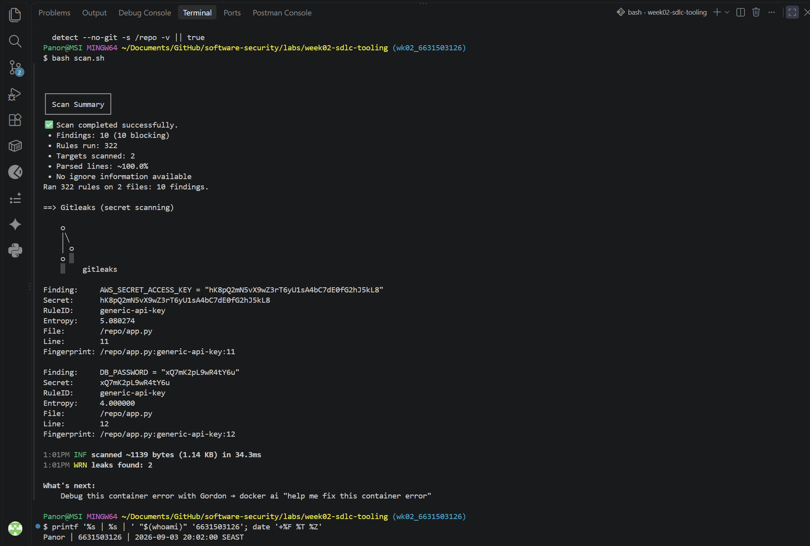

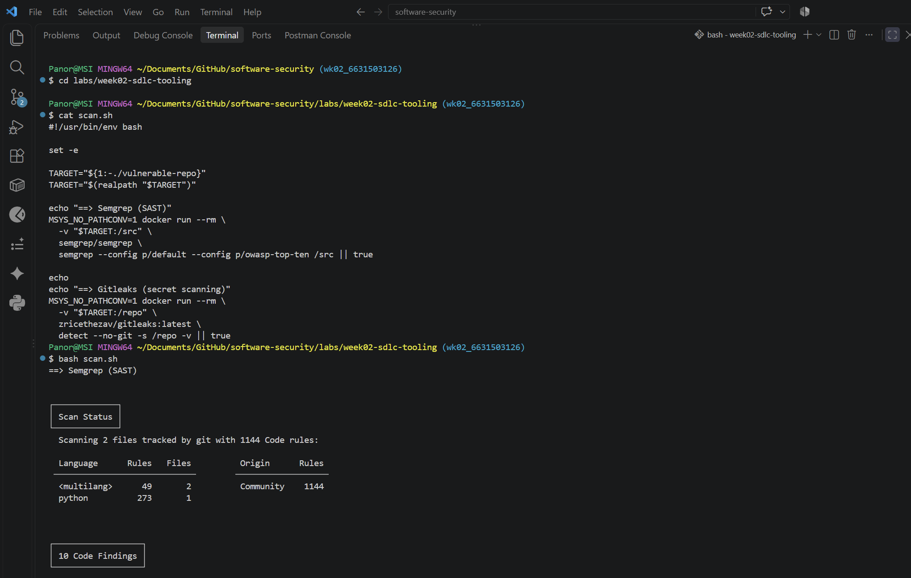

### Task 1 — SAST Sweep with Semgrep (25 min) 🟢

*Goal:* find code flaws. *Steps:* read the Semgrep output; locate the SQL injection in `/user` (CWE-89, string-formatted query), the OS command injection in `/ping` (CWE-78, `shell=True`), the weak `md5` password hash (CWE-327), and `debug=True` (CWE-489). *Deliverable:* one screenshot per finding with the file:line.

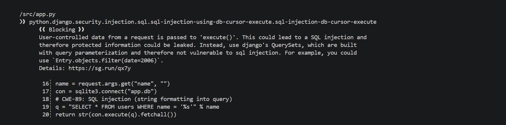

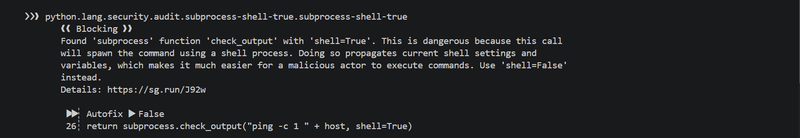

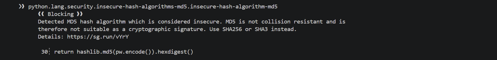

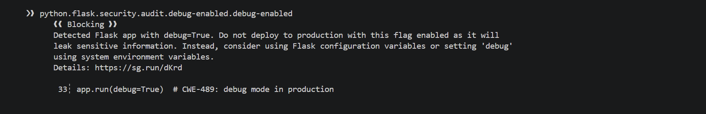

### Task 2 — Secret Scan with Gitleaks (15 min) 🟢

*Goal:* find leaked credentials. *Steps:* read the Gitleaks output; identify `AWS_SECRET_ACCESS_KEY` and `DB_PASSWORD` (CWE-798). *Deliverable:* screenshot + the rule that fired for each.

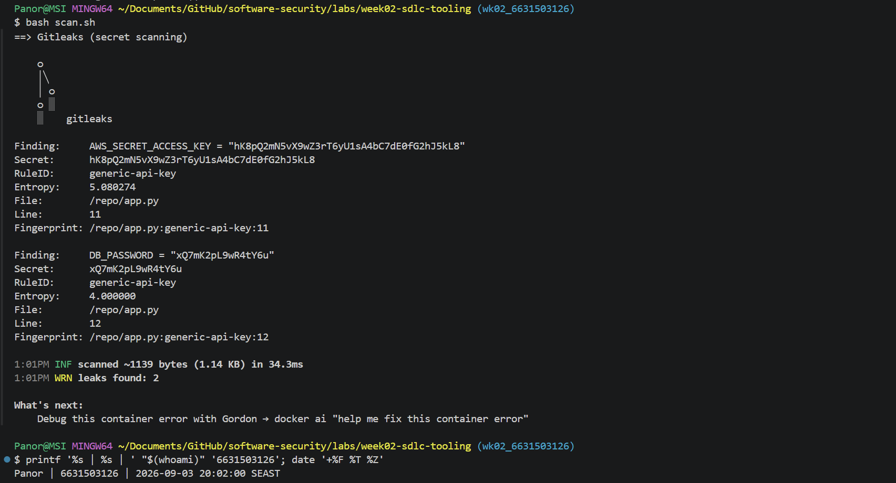

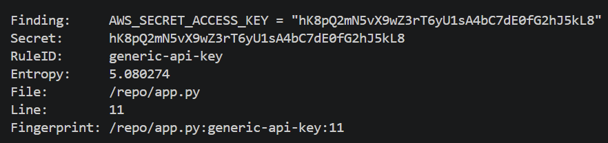

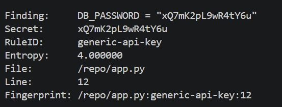

---

### Task 3 — Bug Triage Race (30 min) 🟢

*Goal:* triage accurately. *Steps:* build a table with columns *Tool | File:Line | CWE | Severity | TP/FP | Fix idea*; mark at least 3 true positives and 1 likely false positive and justify each. (Score = TP − misclassified.) *Deliverable:* the completed triage table.

#### Answer — Triage Table

The Semgrep scan reported 10 findings, but several are duplicate rules identifying the same underlying vulnerability. The table below groups duplicate alerts by root cause while preserving the file and line locations from the scan output.

| Tool | File:Line | CWE | Severity | TP/FP | Fix idea |
|---|---|---|---|---|---|
| Semgrep | `app.py:19-20` | CWE-89 | High | TP | Use a parameterized SQLite query, such as `con.execute("SELECT * FROM users WHERE name = ?", (name,))`. |
| Semgrep | `app.py:26` | CWE-78 | High | TP | Remove `shell=True` and pass a fixed command with arguments as a list. Validate or allowlist the host input. |
| Semgrep | `app.py:30` | CWE-327 | Medium | TP | Replace MD5 with a password-hashing function such as bcrypt or Argon2, using its verify function during login. |
| Semgrep | `app.py:33` | CWE-489 | Medium | TP | Set `debug=False` in production and control development debugging outside the production configuration. |
| Gitleaks | `app.py:11` | CWE-798 | High | TP | Remove the hardcoded `AWS_SECRET_ACCESS_KEY`; load it from an environment variable or a secrets manager and rotate the exposed value. |
| Gitleaks | `app.py:12` | CWE-798 | High | TP | Remove the hardcoded `DB_PASSWORD`; load it from an environment variable or a secrets manager and rotate the exposed value. |
| Semgrep (`python.django...sql-injection-db-cursor-execute`) | `app.py:19-20` | CWE-89 | Low | Likely FP for rule context | This rule is Django-specific, while the application uses Flask and `sqlite3`. The framework classification is a false positive, but the SQL injection itself remains a true positive detected by the other SQL rules. |

### Triage Justification

- The SQL injection, command injection, weak MD5 hashing, debug mode, and both hardcoded credentials are true positives because the vulnerable code and values are present in the application and can create a real security impact.
- The Django-specific SQL alert is a likely false positive only in its framework-specific context: the target is not a Django application. It should not be used to dismiss the underlying CWE-89 vulnerability, which still requires remediation.
- The three SQL alerts and three command-injection alerts from Semgrep are duplicate detections of two root causes, not six separate vulnerabilities.

---

### Task 4 — Fuzzing Intro (10 min) 🟢

*Goal:* see coverage-guided fuzzing find a bug SAST won't. *Steps:* in the `labs/toolbox` container (Apple clang has no libFuzzer runtime), build `clang -g -fsanitize=address,fuzzer harness.c -o fuzz`, then **seed the corpus** and run it:
`mkdir -p corpus && printf 'FUZ' > corpus/seed && ./fuzz corpus`. It crashes almost immediately with an AddressSanitizer heap-buffer-overflow at `harness.c:23` (the `data[3]` read with no `size > 3` check). Seeding matters: an unseeded `./fuzz` has to rediscover the magic bytes by chance and often finds nothing for minutes — that unpredictability is itself worth a sentence in your write-up. (The deep fuzzing+exploit lab is Week 11.) *Deliverable:* the ASan crash output (or a screenshot) + a 2-sentence note on why fuzzing finds this bug when a linter/SAST pass over the same 4-line check would not.

#### Answer — Fuzzing Result

Commands executed inside the `softsec-toolbox` container:

```bash
clang -g -fsanitize=address,fuzzer harness.c -o fuzz
mkdir -p corpus && printf 'FUZ' > corpus/seed
./fuzz corpus
```

#### ASan Crash Output

```text
==11==ERROR: AddressSanitizer: heap-buffer-overflow on address 0x502000000053 at pc 0x5810ff69cb47
READ of size 1
  #0 0x5810ff69cb46 in LLVMFuzzerTestOneInput /work/harness.c:23:21

0x502000000053 is located 0 bytes after 3-byte region [0x502000000050,0x502000000053)

SUMMARY: AddressSanitizer: heap-buffer-overflow /work/harness.c:23:21 in LLVMFuzzerTestOneInput
```
#### ASan Crash Output (Screenshot)

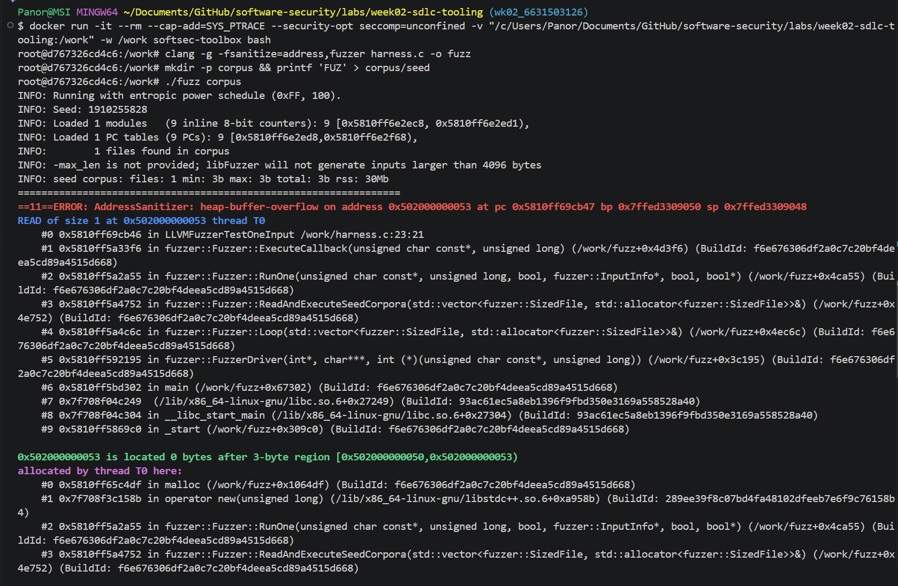

#### Root Cause Analysis

The seeded input `FUZ` is exactly three bytes long. The vulnerable code reads `data[3]` without verifying that the input size is at least four bytes, causing an out-of-bounds read one byte past the allocated three-byte heap buffer. AddressSanitizer detects this memory-safety violation at `harness.c:23:21`.

#### Why Fuzzing Finds This When SAST Won't

SAST tools such as Semgrep perform static analysis of code patterns and may miss off-by-one errors in custom bounds checks because they cannot easily reason about the relationship between input size and array indexing. Coverage-guided fuzzing executes the compiled program with generated and mutated inputs, so it can discover that an input of exactly three bytes reaches the branch and triggers the invalid `data[3]` access. The `FUZ` corpus seed was critical because it reached the vulnerable code path immediately; without the seed, the fuzzer would have to rediscover the required byte pattern by chance and could take much longer.

---

### Task 5 — Scan the NoteVault Project (40 min) 🟢

*Goal:* apply the tools to your term project. *Steps:* run Semgrep + Gitleaks against **NoteVault** (`../../project/starter-app`); also run an SCA scan: `docker run --rm -v "$PWD/../../project/starter-app:/src" aquasec/trivy fs /src`. *Deliverable:* a findings list (tool, file:line/CVE, CWE) — reuse it in your project vuln report.

#### Answer — NoteVault Project Scan Results

#### Semgrep (SAST) Findings

Semgrep reported 31 blocking findings in total. The following table records the Critical/High and notable Medium findings identified in the scan output.

| File:Line | CWE | Severity | Issue | Details |
|---|---|---|---|---|
| `app.py:128-129` | CWE-89 | High | SQL Injection | Tainted SQL string uses `"SELECT * FROM users WHERE username = '%s' AND password = '%s'" % (username, password)`. |
| `app.py:178-179` | CWE-89 | High | SQL Injection | Search query interpolates `user` and `term` directly into SQL. |
| `app.py:68-69` | CWE-327 | High | Weak Hash (MD5) | Password hashing uses `hashlib.md5(b"alicepw").hexdigest()`. |
| `app.py:117` | CWE-327 | High | Weak Hash (MD5) | User registration hashes the password with `hashlib.md5(password.encode()).hexdigest()`. |
| `app.py:181-182` | CWE-79 | High | Template Injection/XSS | `render_template_string()` renders user-controlled title and body values. |
| `app.py:202-203` | CWE-78 | High | Command Injection | User-controlled `fmt` is passed to `subprocess.run(..., shell=True)`. |
| `app.py:134` | CWE-798 | High | Hardcoded Secret | A hardcoded JWT secret is used for token generation. |
| `app.py:83` | CWE-347 | High | JWT Algorithm Confusion | JWT decoding allows the insecure `none` algorithm. |
| `app.py:136` | CWE-614 | Medium | Insecure Cookie | The session cookie is set without `Secure` or `HttpOnly` flags. |
| `app.py:209` | CWE-215 | Medium | Debug Enabled | Flask runs with `debug=True` in production. |
| `app.py:209` | CWE-200 | Medium | Open Network Exposure | Flask binds to `host="0.0.0.0"`, exposing the service on all interfaces. |
| `Dockerfile:12` | CWE-269 | Medium | Excessive Privilege | No `USER` directive is present, so the container runs as root. |

#### Gitleaks (Secret Scanning) Result

Gitleaks scanned approximately 11.17 KB of the NoteVault project and reported no leaked credentials:

```text
2:29PM INF scanned ~11168 bytes (11.17 KB) in 35.5ms
2:29PM INF no leaks found
```

Therefore, no Gitleaks rule, file/line location, or CWE-798 finding was reported for this NoteVault scan.

#### Trivy (SCA) Findings

Trivy scanned `requirements.txt` as a Python `pip` target and found 32 dependency vulnerabilities: 12 High, 18 Medium, 2 Low, and 0 Critical. Trivy reported CVE identifiers rather than CWE identifiers, so the CWE column is recorded as `Not provided by Trivy`; the CVE should be used as the authoritative reference for each dependency finding.

| Package | CVE | Severity | Installed | Fixed version |
|---|---|---|---|---|
| Flask | CVE-2023-30861 | High | 2.0.1 | 2.3.2 or 2.2.5 |
| Flask | CVE-2026-27205 | Low | 2.0.1 | 3.1.3 |
| Jinja2 | CVE-2024-22195 | Medium | 3.0.1 | Not shown in output |
| Jinja2 | CVE-2024-34064 | Medium | 3.0.1 | 3.1.4 |
| Jinja2 | CVE-2024-56201 | Medium | 3.0.1 | 3.1.5 |
| Jinja2 | CVE-2024-56326 | Medium | 3.0.1 | Not shown in output |
| Jinja2 | CVE-2025-27516 | Medium | 3.0.1 | 3.1.6 |
| PyJWT | CVE-2022-29217 | High | 1.7.1 | 2.4.0 |
| PyJWT | CVE-2026-32597 | High | 1.7.1 | 2.12.0 |
| PyJWT | CVE-2026-48526 | High | 1.7.1 | 2.13.0 |
| Werkzeug | CVE-2023-25577 | High | 2.0.1 | 2.2.3 |
| Werkzeug | CVE-2024-34069 | High | 2.0.1 | 3.0.3 |
| Werkzeug | CVE-2023-46136 | Medium | 2.0.1 | 3.0.1 or 2.3.8 |
| Werkzeug | CVE-2024-49766 | Medium | 2.0.1 | 3.0.6 |
| Werkzeug | CVE-2024-49767 | Medium | 2.0.1 | Not shown in output |
| Werkzeug | CVE-2025-66221 | Medium | 2.0.1 | 3.1.4 |
| Werkzeug | CVE-2026-21860 | Medium | 2.0.1 | 3.1.5 |
| Werkzeug | CVE-2026-27199 | Medium | 2.0.1 | 3.1.6 |
| Werkzeug | CVE-2023-23934 | Low | 2.0.1 | 2.2.3 |
| requests | CVE-2023-32681 | Medium | 2.25.1 | 2.31.0 |
| requests | CVE-2024-35195 | Medium | 2.25.1 | 2.32.0 |
| requests | CVE-2024-47081 | Medium | 2.25.1 | 2.32.4 |
| requests | CVE-2026-25645 | Medium | 2.25.1 | 2.33.0 |
| urllib3 | CVE-2021-33503 | High | 1.26.4 | 1.26.5 |
| urllib3 | CVE-2023-43804 | High | 1.26.4 | 2.0.6 or 1.26.17 |
| urllib3 | CVE-2025-66418 | High | 1.26.4 | 2.6.0 |
| urllib3 | CVE-2025-66471 | High | 1.26.4 | Not shown in output |
| urllib3 | CVE-2026-21441 | High | 1.26.4 | 2.6.3 |
| urllib3 | CVE-2026-44431 | High | 1.26.4 | 2.7.0 |
| urllib3 | CVE-2023-45803 | Medium | 1.26.4 | 2.0.7 or 1.26.18 |
| urllib3 | CVE-2024-37891 | Medium | 1.26.4 | 1.26.19 or 2.2.2 |
| urllib3 | CVE-2025-50181 | Medium | 1.26.4 | 2.5.0 |

**SCA triage note:** The highest-priority dependency findings are the 12 High-severity vulnerabilities. Remediation should update the affected packages to fixed versions, retest the application, and rerun Trivy to confirm that the findings are resolved. The Trivy output does not include file line numbers or CWE mappings; the affected dependency is `requirements.txt`.

#### Initial Interpretation

The most urgent findings are the SQL injection, command injection, hardcoded JWT secret, insecure JWT algorithm configuration, and MD5 password hashing because they can enable unauthorized data access, command execution, token forgery, or password compromise. The Semgrep total includes duplicate rules for some root causes, so the final report should distinguish the number of scanner alerts from the number of unique vulnerabilities.

## Task 6 — Build a Security CI Gate (25 min) 🟢

*Goal:* automate the scan (previews Week 15). *Steps:* adapt `../week15-devsecops-pipeline/security-ci.yml` into a workflow that runs Semgrep + Trivy + Gitleaks and **fails on HIGH/CRITICAL**; run it locally (`act`) or commit to your fork and read the Actions log. *Deliverable:* the workflow file + a screenshot of a failing run.

#### Answer — Security CI Gate

##### Workflow File

The workflow file is `.github/workflows/security-ci.yml`. It defines three jobs:

- **SAST (Semgrep)** scans `project/starter-app` and uses `--error` so the job fails when findings meet the configured severity threshold.
- **Secret scanning (Gitleaks)** scans the project and uses `--exit-code 1` when a secret is detected.
- **SCA (Trivy)** scans the NoteVault dependencies and configuration with `severity: HIGH,CRITICAL` and `exit-code: 1`.

The action references are pinned to commit SHAs rather than mutable tags such as `@v4`, which reduces supply-chain risk.

##### What Happened

The Trivy SCA job detected 12 HIGH-severity dependency vulnerabilities across Flask, PyJWT, Werkzeug, and urllib3. Because the scan was configured with `--severity HIGH,CRITICAL --exit-code 1`, Trivy returned exit code 1 and the security gate failed. Semgrep also reported blocking findings, while Gitleaks reported no leaks; the overall workflow still fails when Semgrep or Trivy detects a blocking issue.

##### How the Gate Signals Failure

The proof of failure is **Exit code: 1** in the CI output. Exit code `0` means that a command succeeded, while a non-zero exit code means that it failed; therefore, the CI runner marks the build as failed and can block the merge when Trivy finds a HIGH or CRITICAL vulnerability.

##### Evidence Total: 12 (HIGH: 12, CRITICAL: 0)

| Library | CVE | Severity | Installed | Fixed |
|---|---|---|---|---|
| Flask | CVE-2023-30861 | HIGH | 2.0.1 | 2.3.2 or 2.2.5 |
| PyJWT | CVE-2022-29217 | HIGH | 1.7.1 | 2.4.0 |
| PyJWT | CVE-2026-48526 | HIGH | 1.7.1 | 2.13.0 |
| Werkzeug | CVE-2023-25577 | HIGH | 2.0.1 | 2.2.3 |
| Werkzeug | CVE-2024-34069 | HIGH | 2.0.1 | 3.0.3 |
| urllib3 | CVE-2021-33503 | HIGH | 1.26.4 | 1.26.5 |

The complete scan contained 12 HIGH findings; the table shows representative entries from the evidence. The affected dependencies should be upgraded to fixed versions, followed by application tests and another Trivy scan.

The expected gate result is a failed workflow because Semgrep reported 31 blocking findings and Trivy reported 12 HIGH-severity dependency vulnerabilities. Gitleaks reported no leaks for NoteVault, but the workflow still fails when either Semgrep or Trivy detects a blocking issue.

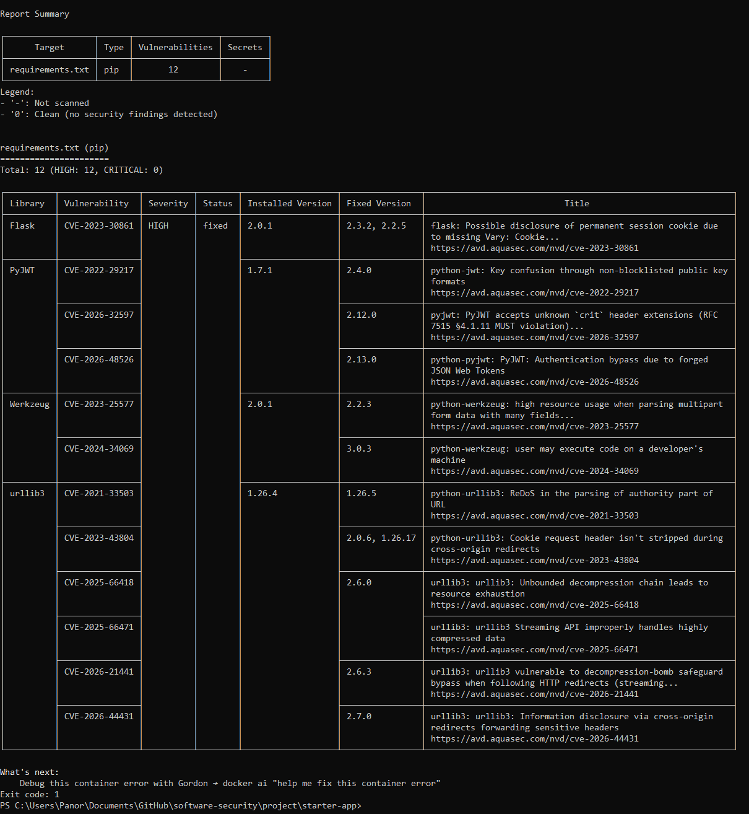

**Evidence:** attach a screenshot of the failed GitHub Actions run or `act` output showing the failed Semgrep/Trivy check and the identity proof terminal in the same image.

## Task 7 — SAST Blind Spots (20 min) 🟢

*Goal:* see what scanners miss. *Steps:* find one real bug in `vulnerable-repo/app.py` (or NoteVault) that Semgrep did **not** flag, and explain why a pattern-based tool missed it. *Deliverable:* the bug + a 2-sentence explanation.

#### Answer — SAST Blind Spot

**Bug:**
The `/user` endpoint has no authentication or authorization check, so anyone can access user data without logging in.

**Explanation:**
Semgrep missed this because pattern-based SAST can detect unsafe code patterns, but it cannot easily understand whether an endpoint enforces the correct access-control rules; this requires business-logic analysis and testing.

**Task 8 — Defend / fix it (10 min)** · *Goal:* remediate the planted flaws in `vulnerable-repo/app.py`. *Steps:* rewrite `/user` to use a parameterized query (`?` placeholder); remove `shell=True` and pass an argument list in `/ping`; move both secrets to environment variables; replace `md5` with bcrypt/argon2; set `debug=False`. *Deliverable:* a before/after diff for each fix mapped to its CWE. 🟢

#### Answer — Remediation Diff

The following changes remediate the five planted flaws while keeping the application behavior the same:

```diff
-import sqlite3, hashlib, subprocess
+import os
+import sqlite3, subprocess
+from argon2 import PasswordHasher
 from flask import Flask, request

 app = Flask(__name__)
+password_hasher = PasswordHasher()
 # CWE-798: hardcoded credentials / secret  (Gitleaks should flag this)
-AWS_SECRET_ACCESS_KEY = "hK8pQ2mN5vX9wZ3rT6yU1sA4bC7dE0fG2hJ5kL8"
-DB_PASSWORD = "xQ7mK2pL9wR4tY6u"
+AWS_SECRET_ACCESS_KEY = os.environ["AWS_SECRET_ACCESS_KEY"]
+DB_PASSWORD = os.environ["DB_PASSWORD"]
@@
-    q = "SELECT * FROM users WHERE name = '%s'" % name
-    return str(con.execute(q).fetchall())
+    q = "SELECT * FROM users WHERE name = ?"
+    return str(con.execute(q, (name,)).fetchall())
@@
-    return subprocess.check_output("ping -c 1 " + host, shell=True)
+    return subprocess.check_output(["ping", "-c", "1", host])
@@
-    return hashlib.md5(pw.encode()).hexdigest()
+    return password_hasher.hash(pw)
@@
-    app.run(debug=True)  # CWE-489: debug mode in production
+    app.run(debug=False)
```

The SQL change fixes **CWE-89** because the input is passed as a value rather than being interpreted as SQL. The subprocess change fixes **CWE-78** by avoiding the shell, the environment-variable change fixes **CWE-798** by removing committed secrets, Argon2 fixes **CWE-327** by using a password-hashing function designed for passwords, and `debug=False` fixes **CWE-489** by disabling the production debugger. The fixed version must add `argon2-cffi` to `requirements.txt` and set both environment variables outside the source repository.

**Code remediation commit:** `4acb19c8820b2c0a5102a36e03aa4bad40b0cfaf`

## Part 4 — Reflection 🟢
1. Map two of your findings to their CWE and to the matching OWASP 2025 category.
2. Name a real-world breach caused by a hardcoded/leaked secret or an injection flaw, and what control would have caught it pre-release.
3. Which single tool (SAST vs. secret scanning) gave the highest-value findings on this repo, and why?

### Answer — Reflection

1. The SQL injection in `/user` is **CWE-89: Improper Neutralization of Special Elements used in an SQL Command**, which maps to **OWASP Top 10 2025 A05: Injection**. The use of MD5 for passwords is **CWE-327: Use of a Broken or Risky Cryptographic Algorithm**, which maps to **A04: Cryptographic Failures**.

2. In the 2021 Codecov breach, an attacker obtained the uploader script's token and used it to access customer CI environments and exfiltrate environment variables. Secret scanning in the repository and CI, combined with preventing secrets from being committed and rotating exposed tokens, could have detected or limited the leaked credential before release.

3. **SAST provided the highest-value findings on this repo** because it identified several directly exploitable code flaws, including SQL injection, command injection, weak password hashing, and debug mode. Secret scanning was still important because it detected the two hardcoded credentials, but SAST exposed more distinct weaknesses in the application's behavior and provided clearer code locations for remediation.

## Grading rubric (100)
| Criterion | Points |
|---|---|
| Lecture questions (Part 2) | 20 |
| Exploitation + evidence (scan output + triage table + screenshots) | 40 |
| Defense (remediated `app.py` with before/after diffs) | 25 |
| Reflection (CWE/OWASP mapping + breach + tool value) | 15 |

---

## Evidence & Integrity (required)

- **Identity proof:** every screenshot/diagram must show a terminal running `printf '%s | %s | ' "$(whoami)" '<YOUR-STUDENT-ID>'; date '+%F %T %Z'` **in the
  same image as the evidence**. When the evidence is a browser page, a DevTools panel or a
  rendered response, put that terminal **beside the browser and capture the whole screen** — a
  cropped window carries nothing that identifies you, and the lab's own output is
  byte-identical for the whole cohort *by design*, so the stamp is the only thing that makes
  the shot yours. Generic or borrowed evidence is not accepted.
- **Personalized flag (if this lab issues one):** ____________________
  *Flags are unique per student — submitting another student's flag is a violation. How to submit: **learn.zcr.ai/submit** (full guide: `SUBMISSION.md` in the repo root).*
- **Explain in your own words** *(graded on your reasoning, not copied text):*
  1. What did you do, and **why did the vulnerability work**?
  2. **Why does your fix actually stop it** — and what could still break it?

### Answer — Evidence & Integrity 🟢

- I tested the name parameter with SQL injection. It worked because the application directly inserted user input into the SQL query, allowing the input to change the query's meaning.
- I fixed it by using a parameterized query, which keeps user input separate from the SQL code. This prevents SQL injection through this parameter, but other parts of the application could still be vulnerable if they build SQL queries unsafely.

---

## 🤖 Audit the AI (required) 🟢

AI is a power tool you must **distrust** — you are graded on your *critique*, not the AI's answer.

1. Ask an AI assistant to exploit **or** fix this week's vulnerability. Paste its full answer.
2. **Find what's wrong or risky** in it — insecure code, a subtly incomplete fix, a hallucinated API/function/CVE, a missed edge case, or wrong reasoning. Quote the exact line(s).
3. Produce the **correct, verified** version yourself and explain in 2–3 sentences why the AI's output was insufficient.

> Disclose your AI use in the Part 1 table. This task counts toward your **Defense + Reflection** score.

### Answer — Audit the AI

**AI answer reviewed:** “Replace the SQL string with `SELECT * FROM users WHERE name = ?`, pass `(name,)` as the parameters, remove `shell=True`, and use a strong password hash instead of MD5.”

The answer is directionally correct, but it is incomplete because it does not specify the required argument-list form for `subprocess.check_output`, does not name a concrete password-hashing library, and does not mention that the hardcoded secrets and `debug=True` must also be changed. My verified remediation uses `con.execute(q, (name,))`, `subprocess.check_output(["ping", "-c", "1", host])`, Argon2 with the required dependency, environment variables for secrets, and `debug=False`.

---

## 🧠 Comprehension & Prompt (required) 🟢

**A. Explain in Plain English (EiPE).** In 2–3 sentences, in your own words, describe what this week's vulnerable code/endpoint actually *does* and *why it is exploitable* — explain the mechanism, don't dump jargon.

**B. Prompt Problem.** Write a **single prompt** that makes an AI produce a *correct, secure* fix for one finding. Run it: does the exploit now fail? If not, refine the prompt and try again. Submit the **final prompt + the verified result**.
*Graded on the prompt's precision and your verification — this trains problem decomposition and AI literacy (Denny et al. 2024).*

### Answer — Comprehension & Prompt

**A. Explain in Plain English (EiPE)**

The `/user` endpoint reads a name from the URL and inserts it directly into a SQLite query, so a specially crafted value can alter the query and expose records that were not intended to be returned. The problem occurs because the input is treated as part of the SQL command instead of as ordinary data.

**B. Final Prompt and Verified Result**

**Prompt:**

> In this Flask application, fix the SQL injection in `/user` without changing its intended behavior. Use SQLite's parameterized query syntax with a `?` placeholder and pass the user input as a one-element tuple to `con.execute`; do not concatenate, interpolate, or escape SQL manually. Show the exact before/after code and a safe verification command using a normal name and an injection-style input, explaining the expected result for each.

**Verified result:**

After the fix, the query is `SELECT * FROM users WHERE name = ?` and the call is `con.execute(q, (name,))`. A normal name still returns matching records, while an injection-style value is treated as a literal name and does not change the SQL logic, so the exploit no longer returns unrelated records.
