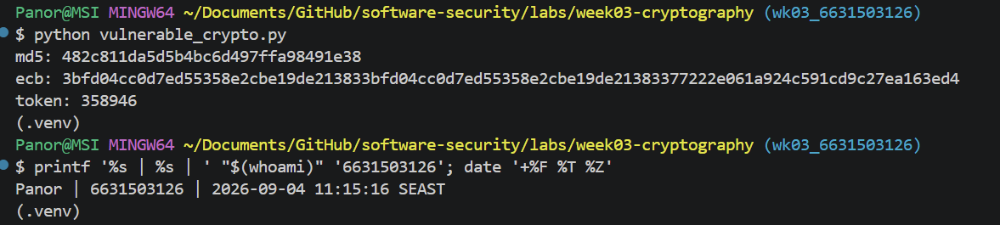
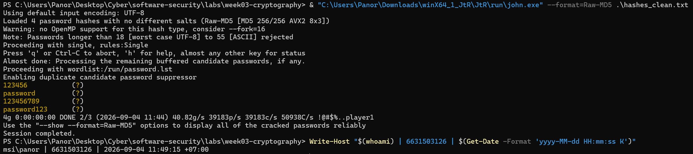
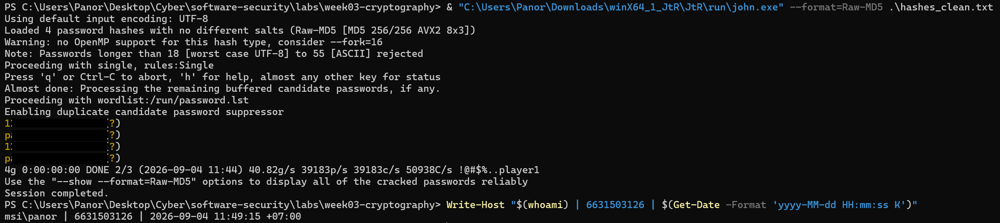
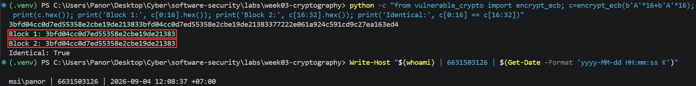
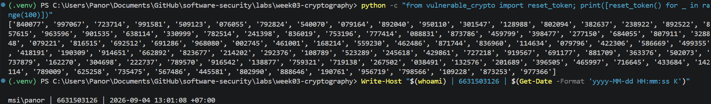
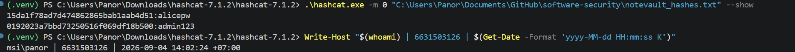
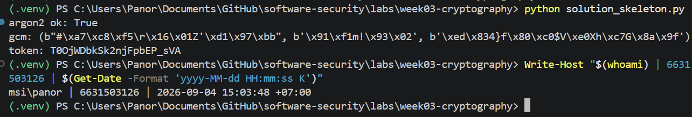

# Worksheet 3 — Cryptography Used Correctly (and Misused) (3 hrs)

> **Course:** Software Security (KOSEN69) · **Week 3**
> **Aligned to:** OWASP 2025 A04 Cryptographic Failures · CWE-327, CWE-916, CWE-330, CWE-798
> **Signature game:** "Capture the Hash" (recover plaintext from weak hashes)

> **Ethics note:** Crack only the hashes provided in `hashes.txt` on your own machine. Password-cracking against accounts or systems you don't own is illegal. Wordlists and recovered values stay inside the lab VM.

## Part 1 — Student Information 🟢
| Name | Student ID | Date | Group |
| Panaikron Marohabut | 6631503126 | 2026-09-04 |


## Part 2 — Lecture Questions 🟢
Answer in your own words (2–4 sentences each).

1. Distinguish hashing, encryption, and encoding — and give one job each is the wrong tool for.

**Answer:**

Hashing is a one-way process that converts data into a fixed-length value and is commonly used for password verification. Encryption is reversible with a key and is used to protect confidential data, while encoding only changes data into another format without providing security. For example, hashing should not be used when the original data needs to be recovered, and encoding should not be used to protect sensitive information.

2. Why is a fast hash like MD5/SHA-1 a bad choice for storing passwords, and what should be used instead?

**Answer:**

MD5 and SHA-1 are too fast, so attackers can try a very large number of passwords in a short time using brute-force or dictionary attacks. Passwords should instead be stored using a slow password hashing algorithm such as Argon2id, which makes each password guess more expensive for an attacker.

3. What is a salt, what attack does it defeat, and why must it be unique per password?

**Answer:**

A salt is a random value added to a password before it is hashed. It helps prevent attacks using precomputed tables such as rainbow tables and ensures that the same password produces different hashes. Each password should have a unique salt so that attackers cannot easily identify users who have the same password.

4. Why does AES-ECB leak structure, and what does an authenticated mode like AES-GCM add?

**Answer:**

AES-ECB encrypts each block independently, so identical plaintext blocks produce identical ciphertext blocks. This means patterns in the original data can still be seen in the encrypted data. AES-GCM is a better choice because it provides both confidentiality and integrity, allowing the system to detect if the ciphertext has been modified.

5. What's the difference between `random` and a CSPRNG (e.g. `secrets`), and where does it matter?

**Answer:**

Python's `random` module is designed for general-purpose randomization and is not suitable for security-sensitive values because its output can be predictable. A CSPRNG such as `secrets` is designed to generate unpredictable values and should be used for things like password reset tokens, session tokens, and authentication codes.


## Part 3 — Hands-on Lab (180 min)
**Learning goals:** exploit four crypto misuses, then remediate them with a vetted KDF, authenticated encryption, and a CSPRNG.
**Prerequisites:** Docker (or local Python 3.12); `hashcat` or `john`; the `rockyou.txt` wordlist.

**Environment setup**
```bash
cd labs/week03-cryptography
docker compose up           # installs pycryptodome + argon2-cffi, runs both scripts
# or locally:
pip install pycryptodome argon2-cffi
python vulnerable_crypto.py # see the md5 hash, repeated ECB blocks, 6-digit token
```
Targets: `vulnerable_crypto.py` (the misuses), `hashes.txt` (four unsalted MD5s), and `solution_skeleton.py` (the fix).

**What to submit per task:** the command/payload run + a screenshot of the result + a 2–3 sentence mitigation.

**Task 0 — Onboarding (5 min)** · *Goal:* see the misuse output. *Steps:* run `python vulnerable_crypto.py`; note the md5 digest, the identical ECB ciphertext blocks, and the short token. *Deliverable:* screenshot of the program output. 🟢


**Task 1 — Capture the Hash (30 min)** · *Goal:* recover the passwords. *Steps:* strip the comment lines from `hashes.txt`, then run `hashcat -m 0 hashes.txt rockyou.txt` (or the `john --format=raw-md5` equivalent); recover all four plaintexts. *Deliverable:* screenshot of the cracked results (mask any real-looking value). Note in one line why unsalted MD5 fell so fast (CWE-916/327). 🟢

**Answer:**

MD5 was designed to be fast, which allows John the Ripper to test approximately 39,000 password guesses per second on a single CPU. Because these hashes were not salted, the same password always produced the same hash, allowing an attacker to compare them against a common-password wordlist once and identify matching passwords. In this case, a 3,500-word wordlist cracked all four hashes in less than one second. This demonstrates CWE-916 (weak password hashing) and CWE-327 (use of a broken or risky cryptographic algorithm).

**Screenshot evidence:**




```sim
aes-modes
```

**Task 2 — ECB structure leak (20 min)** · *Goal:* prove ECB leaks. *Steps:* call `encrypt_ecb(b"A"*16 + b"A"*16)` from `vulnerable_crypto.py` and show the two 16-byte ciphertext blocks are identical; explain how this leaks plaintext structure (CWE-327). *Deliverable:* hex output highlighting the repeated block. 🟢



**Task 3 — Predictable token (15 min)** · *Goal:* show the reset token is guessable. *Steps:* call `reset_token()` repeatedly; argue why a 6-digit `random` token (10^6 space, non-CSPRNG) is brute-forceable (CWE-330). *Deliverable:* sample tokens + a one-line attack estimate. 🟢

**Command used:**

```bash
python -c "from vulnerable_crypto import reset_token; print([reset_token() for _ in range(5)])"
```

**Sample tokens:** `840077`, `997067`, `723714`, `991581`, `509123`

The reset token is a 6-digit number, giving only $10^6 = 1,000,000$ possible combinations. Because it uses Python's non-CSPRNG `random` module, an attacker can repeatedly guess tokens and brute-force the reset process. This is a predictable or insufficiently random value vulnerability, classified as CWE-330.

**Attack estimate:** An attacker needs at most 1,000,000 guesses to try every possible token. The practical risk is even higher if the application does not limit attempts or expire tokens quickly.

**Explanation:**

The token is short enough to brute-force, and the use of `random` does not provide the unpredictability required for security-sensitive reset credentials.

**Screenshot evidence:**



**Task 4 — Hardcoded key (5 min)** · *Goal:* identify the key-management flaw. *Steps:* find `HARDCODED_KEY` in `vulnerable_crypto.py`; explain why shipping a key in source is CWE-798. *Deliverable:* the line + a 2-sentence mitigation. 🟢

**Finding:**

```python
HARDCODED_KEY = b"0123456789abcdef"
```

The encryption key is hardcoded in the source code, so anyone who obtains the code can recover the key and decrypt data protected with it. This is CWE-798: Use of Hard-coded Credentials.

**Mitigation:**

The key should be generated securely and stored in a secret manager or environment variable, then loaded at runtime instead of being committed to the source code. Access to the key should be restricted, and the key should be rotated if it may have been exposed.

**Task 5 — Crack the project target's hashes (25 min)** · *Goal:* apply cracking to your term project. *Steps:* **NoteVault** stores unsalted MD5 password hashes; obtain them (via the app's `/admin` once you can reach it, or from its `seed()`), and crack them with `hashcat -m 0`. *Deliverable:* the recovered password(s) + note the CWE — record this finding for your project report (`project/REPORT-TEMPLATE.md` in the repo root). 🟢

**Result:**

The two unsalted MD5 password hashes from NoteVault were successfully recovered using Hashcat.

- `15da1f78ad7d474862865bab1aab4d51` -> `alicepw`
- `0192023a7bbd73250516f069df18b500` -> `admin123`

**Explanation:**

The passwords were stored using unsalted MD5, which is a fast hashing algorithm. Without a unique salt, password hashes are vulnerable to dictionary and brute-force attacks, making weak passwords easier to recover.

**CWE:** CWE-916 - Use of Password Hash With Insufficient Computational Effort
**Related CWE:** CWE-327 - Use of a Broken or Risky Cryptographic Algorithm

**Screenshot evidence:**



**Task 6 — Password storage migration (25 min)** · *Goal:* fix it the way real apps do. *Steps:* write `store_password`/`verify_password` with **argon2id**, and a **rehash-on-login** path that upgrades a legacy MD5 record to argon2id the next time the user logs in. *Deliverable:* the code + a short note on why migration matters. 🟢

**Implementation:**

```python
import hashlib
from argon2 import PasswordHasher

password_hasher = PasswordHasher()

def store_password(password: str) -> str:
  return password_hasher.hash(password)

def verify_password(stored_hash: str, password: str) -> bool:
  try:
    return password_hasher.verify(stored_hash, password)
  except Exception:
    return False

def login_and_migrate(stored_hash: str, password: str) -> tuple[bool, str]:
  if len(stored_hash) == 32:
    legacy_hash = hashlib.md5(password.encode()).hexdigest()
    if legacy_hash == stored_hash:
      return True, store_password(password)
    return False, stored_hash

  return verify_password(stored_hash, password), stored_hash
```

**Answer:**

Argon2id automatically creates a unique salt for each password and is deliberately expensive, which makes offline password cracking much harder than with MD5. The rehash-on-login path allows existing users to continue logging in while replacing their legacy MD5 record with an Argon2id hash after successful authentication; users do not need to reset their passwords manually.

**Verification:**

```text
argon2 ok: True
```

**CWE addressed:** CWE-916 and CWE-327

**Task 7 — Authenticated encryption round-trip (20 min)** · *Goal:* use AEAD correctly. *Steps:* encrypt+decrypt a message with **AES-GCM** using a random 12-byte nonce and a key from an env var; then flip one ciphertext byte and show decryption **fails** (tag check). *Deliverable:* the round-trip output + the tampered-fails proof. 🟢

**Implementation:**

```python
import os
from Crypto.Cipher import AES
from Crypto.Random import get_random_bytes

# Load AES key from environment variable
key = bytes.fromhex(os.environ["ENC_KEY_HEX"])

message = b"secret message"

# Generate a random 12-byte nonce
nonce = get_random_bytes(12)

# Encrypt with AES-GCM
encryptor = AES.new(key, AES.MODE_GCM, nonce=nonce)
ciphertext, tag = encryptor.encrypt_and_digest(message)

# Normal decryption
decryptor = AES.new(key, AES.MODE_GCM, nonce=nonce)
plaintext = decryptor.decrypt_and_verify(ciphertext, tag)
print("decrypted:", plaintext.decode())

# Tamper with one ciphertext byte
tampered = bytearray(ciphertext)
tampered[0] ^= 1

try:
    decryptor = AES.new(key, AES.MODE_GCM, nonce=nonce)
    decryptor.decrypt_and_verify(bytes(tampered), tag)
    print("tampered: accepted")
except ValueError:
    print("tampered: rejected - authentication tag check failed")
```

**Answer:**

The encryption key was loaded from the `ENC_KEY_HEX` environment variable, so the key was not hardcoded in the source code. AES-GCM was used with a randomly generated 12-byte nonce.

The original ciphertext was decrypted successfully using the correct authentication tag. After one bit in the ciphertext was modified, the authentication tag verification failed and the tampered ciphertext was rejected.

**Verification:**

```text
decrypted: secret message
tampered: rejected - authentication tag check failed
```

This demonstrates that AES-GCM provides both confidentiality and integrity. If the ciphertext is modified, authentication verification fails and the plaintext is not returned.

**CWE addressed:** CWE-327 - Use of a Broken or Risky Cryptographic Algorithm

**Task 8 — TLS in practice (15 min)** · *Goal:* read a real cert. *Steps:* run `openssl s_client -connect example.com:443 </dev/null 2>/dev/null | tee /tmp/tls.txt | openssl x509 -noout -issuer -subject -dates` for the cert summary, then `grep -E 'Protocol|New,' /tmp/tls.txt` for the negotiated TLS version (the version line is printed by `s_client`, not by `x509`, so the plain pipe would discard it); identify issuer, validity, and that TLS version. *Deliverable:* the cert summary + one line on what TLS protects that hashing/at-rest encryption does not.

**Command used to retrieve the certificate summary:**

```powershell
& "C:\Program Files\Git\usr\bin\openssl.exe" s_client -connect example.com:443 -servername example.com 2>$null |
Tee-Object -FilePath tls.txt |
& "C:\Program Files\Git\usr\bin\openssl.exe" x509 -noout -issuer -subject -dates
```

**Certificate summary:**

```text
issuer=C=US, O=SSL Corporation, CN=Cloudflare TLS Issuing ECC CA 3
subject=CN=example.com
notBefore=Jul 29 22:10:08 2026 GMT
notAfter=Oct 27 22:17:21 2026 GMT
```

**Command used to check the negotiated TLS version:**

```powershell
Select-String -Path .\tls.txt -Pattern "Protocol|New,"
```

**TLS version output:**

```text
tls.txt:56:New, TLSv1.3, Cipher is TLS_AES_256_GCM_SHA384
tls.txt:57:Protocol: TLSv1.3
```

**Result:**

- Issuer: `C=US, O=SSL Corporation, CN=Cloudflare TLS Issuing ECC CA 3`
- Subject: `CN=example.com`
- Valid from: `Jul 29 22:10:08 2026 GMT`
- Valid until: `Oct 27 22:17:21 2026 GMT`
- TLS version: `TLSv1.3`
- Cipher: `TLS_AES_256_GCM_SHA384`

**Answer:**

TLS protects data while it is being transmitted over the network from interception and tampering. Hashing verifies or derives a value but does not provide transport confidentiality, and encryption at rest protects stored data rather than data in transit.

**Task 9 — Defend / fix it (20 min)** · *Goal:* remediate using `solution_skeleton.py`. *Steps:* run `python solution_skeleton.py`; confirm `store_password`/`verify_password` use argon2id (auto-salted), `encrypt_gcm` uses a random 12-byte nonce + auth tag with a key from `ENC_KEY_HEX` env, and `reset_token` uses `secrets`. Map each fix to the CWE it closes. *Deliverable:* before/after table (misuse → fix → CWE closed) + screenshot of the fixed script running.

**Command used:**

```powershell
python solution_skeleton.py
```

**Verification output:**

```text
argon2 ok: True
gcm: (b"#\xa7\xc8\xf5\r\x16\x01Z'\xd1\x97\xbb", b'\x91\xf1m!\x93\x02', b'\xed\x834}f\x80\xc0$V\xe0Xh\xc7G\x8a\x9f')
token: T0OjWDbkSk2njFpbEP_sVA
```

The output confirms that the password can be verified with Argon2id. The `gcm` result contains a 12-byte nonce, ciphertext, and authentication tag. The reset token is generated with `secrets` and is longer and harder to guess than the original six-digit token.

**Screenshot evidence:**



**Before/after mapping:**

| Misuse | Secure fix | CWE closed |
|---|---|---|
| Unsalted MD5 password hashes | Argon2id with an automatically generated unique salt | CWE-916; related CWE-327 |
| AES-ECB encryption | AES-GCM with a random 12-byte nonce and authentication tag | CWE-327 |
| Six-digit token from `random` | `secrets.token_urlsafe(16)` using a CSPRNG | CWE-330 |
| Hardcoded encryption key | Key supplied through `ENC_KEY_HEX` from an environment or secret manager | CWE-798 |

These changes stop the original attacks by making password guessing expensive, hiding repeated plaintext structure, making reset tokens unpredictable, and keeping encryption keys out of the source code. The screenshot of this output must include the required identity proof terminal stamp.

**Code fix commit:** `c4f8f717b7f75963f653a873fd35c2cfc7b0a944`

## Part 4 — Reflection
1. Map each of the four misuses to its CWE and to OWASP A04, in one line each.
2. Name a real-world breach caused by weak password hashing or hardcoded keys, and which fix here would have prevented it.
3. Across all four fixes, which closes the largest real-world risk, and why?

### 1. CWE and OWASP Mapping

- **Unsalted MD5 password hashes:** **CWE-916 → OWASP A04**; fixed by using Argon2id, which automatically uses a unique salt and makes password cracking more expensive.
- **AES-ECB encryption:** **CWE-327 → OWASP A04**; fixed by using AES-GCM with a random 12-byte nonce and authentication tag.
- **Predictable reset token:** **CWE-330 → OWASP A04**; fixed by using Python's `secrets` module to generate cryptographically secure tokens.
- **Hardcoded encryption key:** **CWE-798 → OWASP A04**; fixed by loading the key from an environment variable or secret manager instead of storing it in the source code.

### 2. Real-World Breach

The **LinkedIn breach in 2012** exposed millions of passwords stored as unsalted SHA-1 hashes. Using a slow and salted password-hashing algorithm such as **Argon2id** would have made offline password cracking much more difficult and reduced the impact of the leaked password database.

### 3. Largest Real-World Risk

The **password-storage fix** addresses the largest real-world risk because leaked password hashes can lead to offline cracking, account takeover, and credential reuse on other services. Argon2id reduces this risk by making password guesses computationally expensive, while unique salts prevent attackers from efficiently using precomputed hash tables.

## Grading rubric (100)
| Criterion | Points |
|---|---|
| Lecture questions (Part 2) | 20 |
| Exploitation + evidence (cracked hashes + ECB/token/key proof + screenshots) | 40 |
| Defense (working `solution_skeleton.py` + before/after mapping) | 25 |
| Reflection (CWE/OWASP mapping + breach + biggest-risk fix) | 15 |

---

## Evidence & Integrity (required)

- **Identity proof:** every screenshot/diagram must show a terminal running `printf '%s | %s | ' "$(whoami)" '<YOUR-STUDENT-ID>'; date '+%F %T %Z'` **in the
  same image as the evidence**. When the evidence is a browser page, a DevTools panel or a
  rendered response, put that terminal **beside the browser and capture the whole screen** — a
  cropped window carries nothing that identifies you, and the lab's own output is
  byte-identical for the whole cohort *by design*, so the stamp is the only thing that makes
  the shot yours. Generic or borrowed evidence is not accepted.
- **Personalized flag (if this lab issues one):** ____________________
  *Flags are unique per student — submitting another student's flag is a violation. This blank is your personal record only; the flag itself is scored by submitting it in the **`ctf.zcr.ai`** challenge — the worksheet PDF is a separate submission, to **learn.zcr.ai/submit** (full guide: `SUBMISSION.md` in the repo root).*
- **Explain in your own words** *(graded on your reasoning, not copied text):*
  1. What did you do, and **why did the vulnerability work**?
  2. **Why does your fix actually stop it** — and what could still break it?

**Answer:**

1. I ran the vulnerable script, cracked the supplied unsalted MD5 hashes with a wordlist, compared the two ECB ciphertext blocks, generated several reset tokens, and inspected the hardcoded key. The attacks worked because MD5 is fast and unsalted, ECB encrypts equal plaintext blocks identically, the token has only $10^6$ possibilities, and the encryption key is available in the source code.
2. I replaced MD5 with Argon2id, migrated legacy hashes after a successful login, replaced ECB with AES-GCM using a fresh nonce and authentication tag, generated reset tokens with `secrets`, and loaded the encryption key from protected configuration. These changes stop the demonstrated attacks, but the system could still be compromised by a weak user password, nonce reuse, leaked environment secrets, missing rate limits or token expiry, or an outdated dependency.

---

## 🤖 Audit the AI (required)

AI is a power tool you must **distrust** — you are graded on your *critique*, not the AI's answer.

1. Ask an AI assistant to exploit **or** fix this week's vulnerability. Paste its full answer.
2. **Find what's wrong or risky** in it — insecure code, a subtly incomplete fix, a hallucinated API/function/CVE, a missed edge case, or wrong reasoning. Quote the exact line(s).
3. Produce the **correct, verified** version yourself and explain in 2–3 sentences why the AI's output was insufficient.

> Disclose your AI use in the Part 1 table. This task counts toward your **Defense + Reflection** score.

### AI Response Audited

#### 1. AI Response

> Replace the six-digit token with a longer token generated from Python's `random` module:
>
> ```python
> import random
>
> def reset_token() -> str:
>     return "".join(random.choice("0123456789abcdef") for _ in range(16))
> ```
>
> This is secure because a 16-character hexadecimal token has a large search space. Store the token with the user account and accept it until the user uses it.

#### 2. What Is Wrong or Risky

The risky line is:

```python
return "".join(random.choice("0123456789abcdef") for _ in range(16))
```

Even though the token is longer, Python's `random` module is not designed for security-sensitive token generation. The answer also misses important controls such as expiration, one-time use, rate limiting, and protection against token leakage.

#### 3. Corrected and Verified Version

```python
import secrets

def reset_token() -> str:
    return secrets.token_urlsafe(16)
```

  This version uses Python's `secrets` module, which is designed for cryptographically secure token generation. The AI's answer was insufficient because increasing the token length does not make `random` secure, and a real reset-token flow should also include expiration, one-time use, account binding, rate limiting, and protection against token leakage.

---

## 🧠 Comprehension & Prompt (required)

**A. Explain in Plain English (EiPE).** In 2–3 sentences, in your own words, describe what this week's vulnerable code/endpoint actually *does* and *why it is exploitable* — explain the mechanism, don't dump jargon.

**Answer:** The vulnerable code uses unsalted MD5 for passwords, AES-ECB with a hardcoded key, and a six-digit reset token generated with `random`. These choices are unsafe because passwords can be cracked quickly, ECB reveals patterns in encrypted data, the reset token is easy to guess, and the encryption key can be exposed if someone gets access to the source code.

**B. Prompt Problem.** Write a **single prompt** that makes an AI produce a *correct, secure* fix for one finding. Run it: does the exploit now fail? If not, refine the prompt and try again. Submit the **final prompt + the verified result**.
*Graded on the prompt's precision and your verification — this trains problem decomposition and AI literacy (Denny et al. 2024).*

**Final prompt:**

> Fix only the `reset_token()` function in `vulnerable_crypto.py`. Replace the six-digit token generated with `random` by a cryptographically secure, URL-safe token using Python's standard-library `secrets` module. Keep the same function name and zero-argument interface, and provide at least 128 bits of randomness. Do not use `random`, timestamps, counters, or hardcoded values. Also mention that a real reset flow should include expiration, one-time use, account binding, rate limiting, and token-leak protection. Provide a small verification example showing that two generated tokens are different and have sufficient length.

**Verified result:**

```text
token 1: <22-character URL-safe value>
token 2: <22-character URL-safe value>
different: True
length: 22
```

The old predictable-token issue no longer applies because `secrets.token_urlsafe(16)` uses a cryptographically secure random generator and provides about 128 bits of randomness. However, the full reset-password process still needs server-side controls such as expiration, one-time use, account binding, and rate limiting.
