# Worksheet 5 — Cross-Site Scripting & Client-Side Risks (3 hrs)

> **Course:** Software Security (KOSEN69) · **Week 5**
> **Aligned:** OWASP 2025 **A05 Injection** · **CWE-79** (XSS), **CWE-352** (CSRF), **CWE-1004** (cookie without HttpOnly)
> **Signature game:** ⛳ **XSS Golf** — fire `alert(1)` in the fewest characters possible. Lower payload length = lower score = better. Par for reflected is the `` vector; can you go under par?

> ⚠️ **Ethics note:** Use only the provided `vulnerable_app.py` sandbox and your own Juice Shop container. Stealing real users' cookies or sessions is illegal. All "session theft" steps here target the sandbox cookie `session=abc123` only.

## Part 1 — Student Information 🟢

| Name | Student ID | Date | Group |
| Panaikron Marohabut | 6631503126 | 2026-09-11 | |

## Part 2 — Lecture Questions 🟢

Answer in 2–4 sentences each.

1. Distinguish **reflected**, **stored**, and **DOM-based** XSS by *where* the untrusted data is injected and *when* it executes. Which two does our `vulnerable_app.py` implement, and at which routes?

ANSWER: "Reflected XSS" happens when input from the request is immediately returned in the response and executes when the victim opens the crafted URL. "Stored XSS" saves the payload on the server and executes when someone later views the stored content, while "DOM-based XSS" happens when client-side JavaScript puts untrusted data into the DOM. In `vulnerable_app.py`, reflected XSS is at `/hello`, and stored XSS is at `/comments`.

2. How does **contextual output encoding** (`markupsafe.escape`) stop `<script>` from executing? Why is HTML-context encoding different from JavaScript- or URL-context encoding?

ANSWER: `markupsafe.escape` changes special HTML characters such as `<` into `<`, so the browser treats `<script>` as text instead of executable HTML. Encoding must match the context because HTML, JavaScript, and URLs use different syntax and special characters.

3. Explain how a strict **Content-Security-Policy** (`script-src 'self'`) defeats an *injected* inline script even when encoding is missing.

ANSWER: A CSP such as `script-src 'self'` allows scripts from the same origin and blocks unapproved inline scripts. Therefore, an injected inline `<script>` cannot execute even if output encoding is missing. CSP is defense-in-depth and should be used together with output encoding.

4. What do the cookie flags **HttpOnly**, **SameSite**, and **Secure** each protect against? Map each to a concrete attack (cookie theft via XSS, CSRF, network sniffing).

ANSWER: `HttpOnly` prevents JavaScript from reading cookies and helps reduce cookie theft through XSS. `SameSite` restricts cookies on cross-site requests and helps prevent CSRF. `Secure` ensures cookies are sent only over HTTPS, helping protect them from network sniffing.

5. Why does **CSRF** (CWE-352) work even without any script injection, and how does `SameSite=Strict` plus the same-origin policy blunt it?

ANSWER: CSRF does not require script injection because an attacker only needs to make the victim's browser send an unwanted request, and the browser may automatically attach the victim's cookies. `SameSite=Strict` helps prevent cookies from being attached to cross-site requests, while the Same-Origin Policy prevents the attacker from reading responses from another origin. However, SOP does not block every cross-site request.

## Part 3 — Hands-on Lab (150 min)


**Learning goals:** land reflected + stored XSS, abuse a JS-readable cookie, build a CSRF PoC against the comment board, then prove `fixed_app.py` blocks all of it.

**Prerequisites:** Docker + Docker Compose, a browser with DevTools, a text editor. Working dir: `labs/week05-xss-client-side/`.

### Environment setup

```bash
cd labs/week05-xss-client-side
docker compose up            # python:3.12-slim + flask, runs vulnerable_app.py
# vulnerable app -> http://localhost:8080   (service name: xss-lab, port 8080)
```
Optional secondary target (for DOM XSS, which our app does not expose):
```bash
docker run --rm -p 3000:3000 bkimminich/juice-shop       # -> http://localhost:3000
```

**What to submit per task:** the exact **payload**, a **screenshot** of the alert/effect, and a **2–3 sentence mitigation**.

---

*Note: Port 8080 was unavailable on the host machine, so the Docker host port was changed to 8180 while the container still uses port 5000.*

🟢 **Task 0 — Onboarding (5 min).** Browse `http://localhost:8080/`. Open DevTools → Application → Cookies and confirm `session=abc123` is set with **no HttpOnly / SameSite**. Screenshot it. *Deliverable: screenshot.*

**Screenshot**

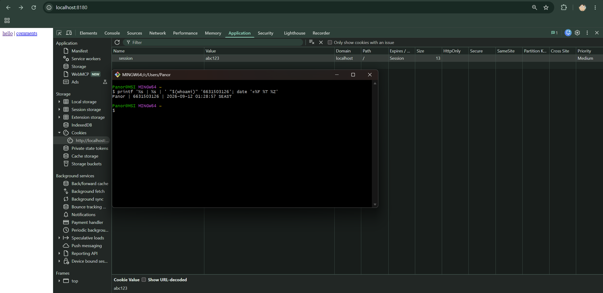

**Task 1 — Reflected XSS + XSS Golf (30 min) ⛳.**
- *Goal:* execute JS via `/hello`, then minimize the payload.
- *Steps:* visit `/hello?name=<script>alert(1)</script>`, then the alternate `/hello?name=` (useful when `<script>` tags specifically are filtered — note it's actually 3 characters longer, not shorter). Record each payload's character count for your golf score.
- *Deliverable:* both payloads + char counts + screenshot of `alert(1)` + your lowest score.

### Task 1 Answer (6631503126)

**Payload 1 — `<script>alert(1)</script>` (27 chars)**

http://localhost:8180/hello?name=<script>alert(1)</script>

Result: alert(1) popup appears.

**Screenshot**
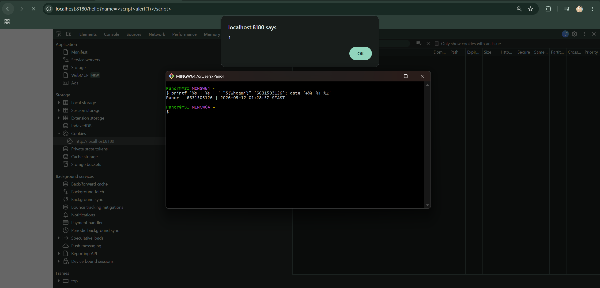

**Payload 2 — `` (30 chars)**

http://localhost:8180/hello?name=

Result: alert(1) popup appears.

**Screenshot**
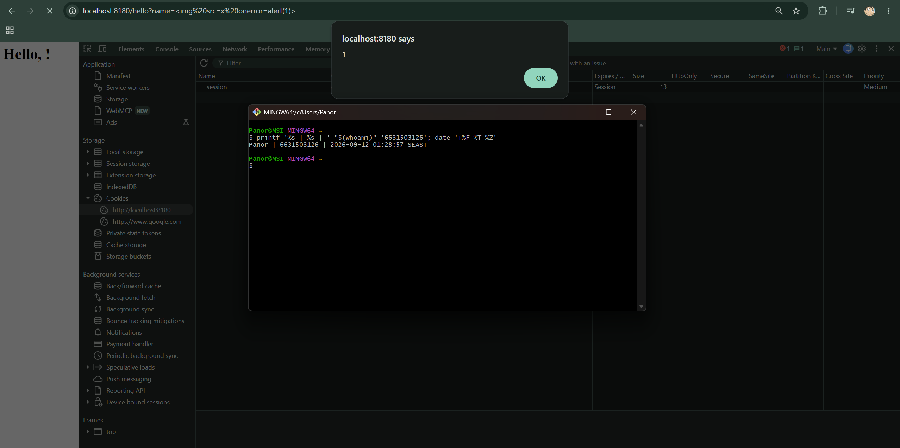

**Lowest score: 27 chars** (`<script>alert(1)</script>`)

**Mitigation**
Use contextual output encoding (e.g. `markupsafe.escape`) when reflecting user input into HTML, so `<` and `>` become `<` and `>` and the browser renders them as text instead of executable tags.

🟢 **Task 2 — Stored XSS (30 min) ⛳.**
- *Goal:* persist a script that runs for every visitor of `/comments`.
- *Steps:* POST a comment with body `<script>alert(document.cookie)</script>` (use the form or `curl -d 'body=...'`). Reload `/comments` and watch the cookie pop.
- *Deliverable:* payload + screenshot of the alert showing `session=abc123` + why stored XSS is more dangerous than reflected.

### Task 2 Answer (6631503126)

**Payload**

```text
<script>alert(document.cookie)</script>
```

POSTed to `/comments` via the on-page form.

**Result**

```text
session=abc123
```

**Screenshot**

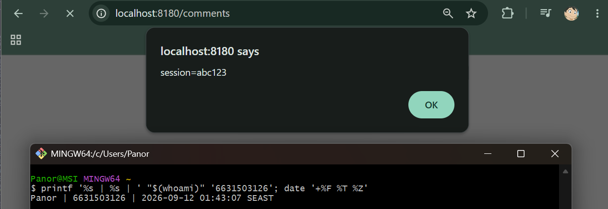

**Why stored XSS is more dangerous than reflected**

Reflected XSS requires the attacker to trick a victim into clicking a malicious URL, so the payload lives only in that single request. Stored XSS persists the payload on the server, meaning every visitor to `/comments` automatically executes the script without clicking anything. This makes stored XSS self-propagating and able to attack a much larger audience.

**Mitigation**

Encode stored user input with `markupsafe.escape` before rendering, or sanitize the input so HTML tags are not interpreted. With proper output encoding, `<script>` becomes `&lt;script&gt;` and the browser displays it as text instead of executing it.

🟢 **Task 3 — Cookie theft via XSS (25 min).**
- *Goal:* show the cookie is readable by injected JS because **HttpOnly is missing** (CWE-1004).
- *Steps:* store `<script>new Image().src='http://localhost:8080/hello?name='+document.cookie</script>` (a beacon), or simply ``. Observe the cookie value being exfiltrated/displayed.
- *Deliverable:* payload + screenshot + 2–3 sentences on how HttpOnly would have stopped this.

### Task 3 Answer (6631503126)

**Payload**

```text

```

**Result**

```text
session=abc123
```

**Screenshot**

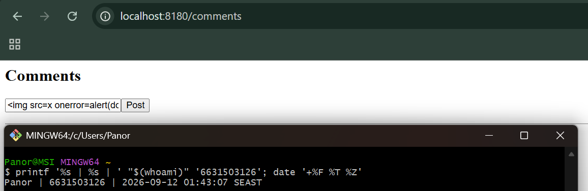
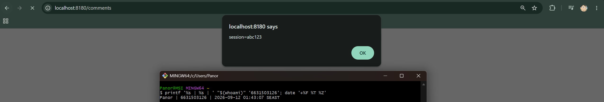

**How HttpOnly would have stopped this**

The `HttpOnly` flag tells the browser that a cookie must not be accessible through JavaScript. If the `session` cookie had `HttpOnly`, `document.cookie` would not have included it, so the injected `alert(document.cookie)` would have produced an empty or incomplete value. This prevents XSS payloads from exfiltrating the session token to an attacker-controlled server.

🟢 **Task 4 — CSRF PoC (30 min).**
- *Goal:* make a third-party page force a state-changing POST to `/comments`.
- *Steps:* create a local `csrf.html` with an auto-submitting form targeting the board (no token exists, cookie has no SameSite, so the browser attaches `session` cross-site):
  ```html
  <body onload="document.forms[0].submit()">
    <form action="http://localhost:8080/comments" method="POST">
      <input name="body" value="CSRF posted this comment">
    </form>
  </body>
  ```
  Open the file and confirm the comment appears on `/comments`.
- *Deliverable:* the HTML + screenshot of the forged comment + why `SameSite=Strict` blocks it.

### Task 4 Answer (6631503126)

**HTML (`csrf.html`)**

```html
<body onload="document.forms[0].submit()">
  <form action="http://localhost:8180/comments" method="POST">
    <input name="body" value="CSRF posted this comment">
  </form>
</body>
```

**Result**

After opening `csrf.html` in the browser, the form auto-submitted a POST to `/comments`. The forged comment `CSRF posted this comment` appeared on `/comments` without the user interacting with the comment board.

**Screenshot**

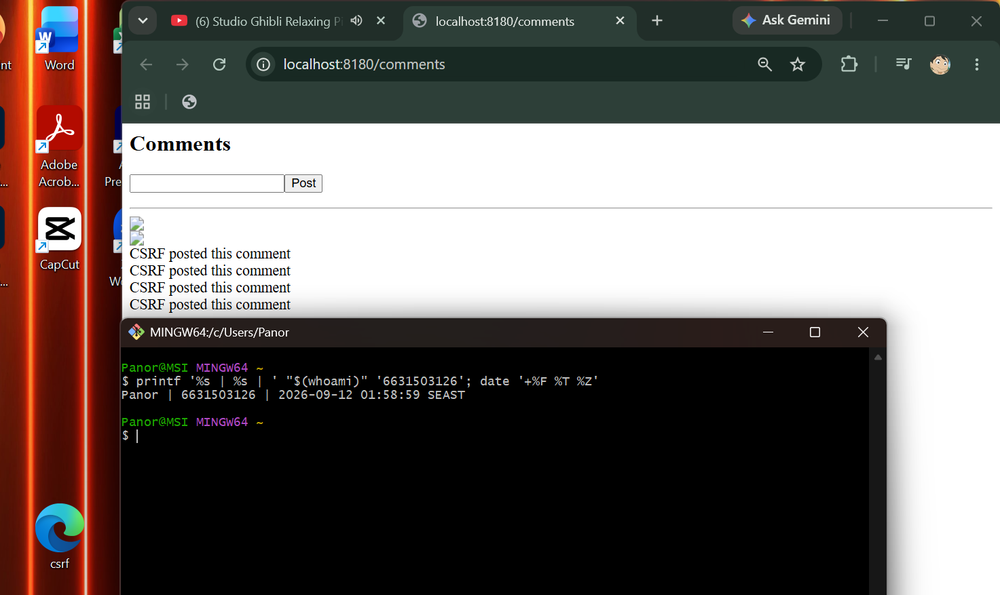

**Why `SameSite=Strict` would block it**

`SameSite=Strict` tells the browser not to attach the cookie to cross-site requests. Because `csrf.html` is opened from the local filesystem or a different origin, the POST to `localhost:8180` would not include the `session` cookie. The server would then receive the forged request without an authenticated session and could reject it, stopping the CSRF attack.

```sim
xss-context
```

**Task 5 — Defend / fix it (30 min) 🛡️.**
- *Goal:* prove `fixed_app.py` blocks Tasks 1–3, then show that Task 4's CSRF PoC still gets through and explain why.
- *Steps:* stop the vulnerable container (`Ctrl-C`), then:
  ```bash
  docker compose run --rm --service-ports xss-lab bash -c "pip install --no-cache-dir flask && python fixed_app.py"
  ```
  Re-fire each payload. Expected: `/hello` renders the script **as text** (escape, L21), stored comments render literally (Jinja autoescape, L30–33), a strict CSP header is now present as defense-in-depth (`Content-Security-Policy: script-src 'self'`, L12 — check DevTools → Network → Response Headers; escaping already neutralizes these payloads, so no CSP *violation* fires in the console), and the cookie now has `HttpOnly; SameSite=Strict; Secure` (L42). Then re-run Task 4's `csrf.html` PoC against `fixed_app.py`: it **still posts the forged comment** — `/comments` (L25–28) never checks the `session` cookie or a CSRF token before accepting a POST, so hardening the cookie only stops the browser from *attaching* it cross-site; it doesn't stop the request itself from being processed.
- *Deliverable:* screenshots of escaped output + the CSP response header + the hardened cookie flags + the still-successful Task 4 forgery against `fixed_app.py`, with 2–3 sentences on why cookie hardening alone doesn't close CSRF here (no server-side check tied to the cookie, and no CSRF token).

### Task 5 Answer (6631503126)

**Setup**

Stopped the vulnerable container, then ran `fixed_app.py`:

```bash
docker compose run --rm --service-ports xss-lab bash -c "pip install --no-cache-dir flask && python fixed_app.py"
```

**1) Reflected XSS is now escaped (Task 1 blocked)**

Payload re-fired:

```text
http://localhost:8180/hello?name=<script>alert(1)</script>
```

Result: the page renders `Hello, <script>alert(1)</script>!` as text. No `alert(1)` popup appears, because `markupsafe.escape()` (L21) converts `<` and `>` into HTML entities.

**Screenshot**

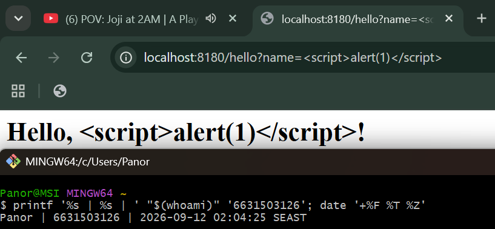

**2) Strict CSP header is present (defense-in-depth)**

`curl -v http://localhost:8180/hello` shows the response header:

```text
Content-Security-Policy: default-src 'self'; script-src 'self'; object-src 'none'
```

Even if escaping were missing, this CSP would block an injected inline `<script>` from executing, because `script-src 'self'` disallows inline scripts.

**Screenshot**

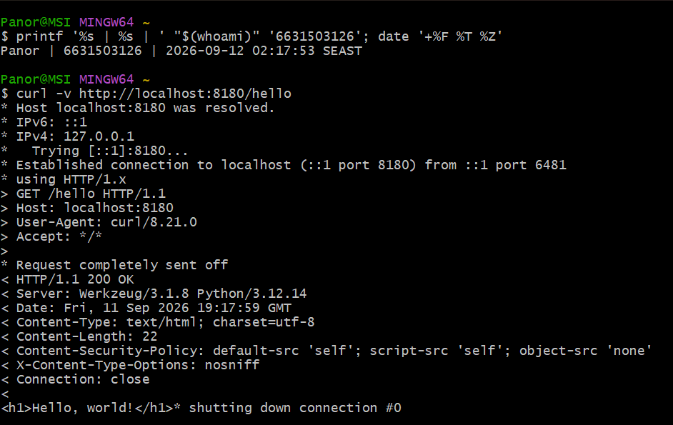

**3) Cookie is now hardened (Task 3 blocked)**

The `session` cookie is now set with `HttpOnly; SameSite=Strict; Secure` (L42). `document.cookie` no longer exposes the cookie to JavaScript, so the Task 3 beacon payload cannot exfiltrate it.

**Screenshot**

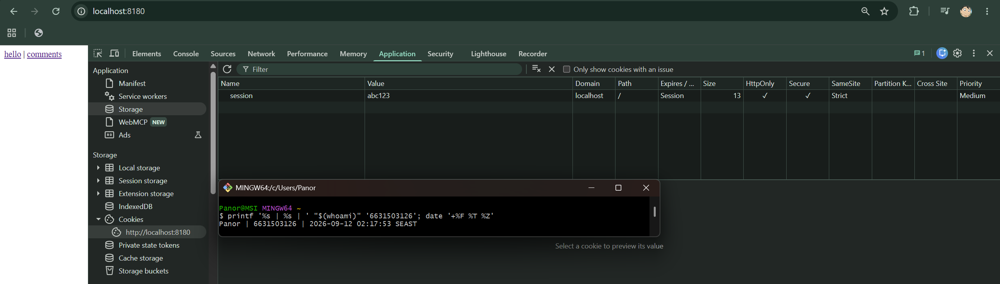

**4) Stored XSS is escaped AND Task 4 CSRF PoC still succeeds against `fixed_app.py`**

Posting `<script>alert(document.cookie)</script>` to `/comments` no longer executes — the comment is rendered literally as text via Jinja autoescaping (L30–33), so no `alert` popup appears on reload. However, re-opening `csrf.html` still causes `CSRF posted this comment` to appear on `/comments`, because the POST handler (L25–28) never checks a CSRF token or the session cookie. The same screenshot shows both effects: the escaped `<script>` comment and the forged `CSRF posted this comment`.

**Screenshot**

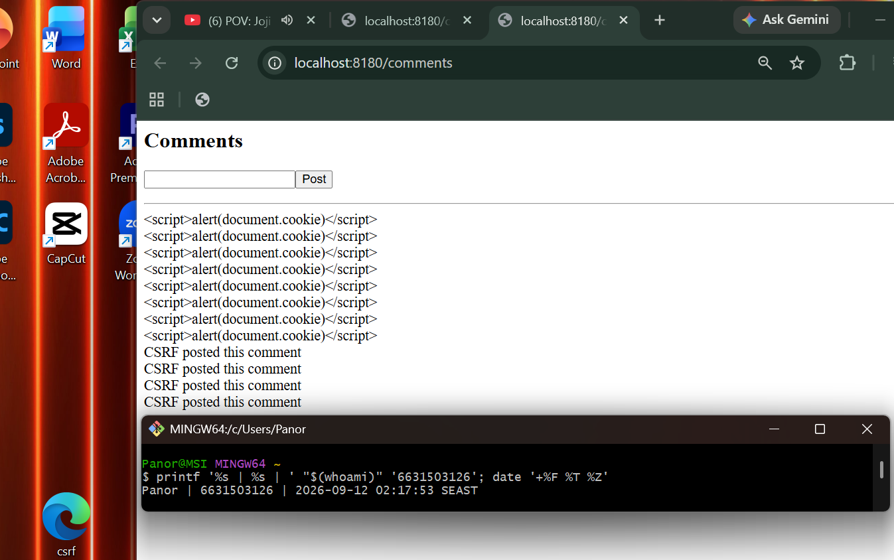

**Why cookie hardening alone doesn't close CSRF here**

Hardening the cookie only stops the browser from *attaching* the `session` cookie to cross-site requests; it does not stop the request itself from being sent and processed. The `/comments` POST handler (L25–28) never validates a CSRF token or checks that the request originated from an authenticated same-origin user, so the forged comment is still accepted even without the cookie. A real fix requires a server-side CSRF token (e.g. `flask-wtf` / double-submit cookie) and an explicit origin check.

## Part 4 — Reflection

1. **CWE/OWASP mapping:** map your reflected/stored XSS to **CWE-79** and your CSRF PoC to **CWE-352**, both under OWASP 2025 **A05 Injection** (CSRF historically A01/A05).

ANSWER: Reflected XSS at `/hello` and stored XSS at `/comments` map to **CWE-79** because untrusted input is inserted into HTML without escaping. The CSRF PoC maps to **CWE-352** because an external site can force the victim's browser to send an unwanted POST request. Both are under OWASP 2025 **A05 Injection**.

2. **Real breach:** the **2018 British Airways breach** (~380k payment records) used malicious JavaScript (Magecart) injected into the site to skim card data — a client-side script-injection failure. In 3–4 sentences relate it to this lab's XSS and CSP lessons.

ANSWER: In the 2018 British Airways breach, attackers injected malicious JavaScript to steal customers' card data. This is similar to stored XSS at `/comments`, where a saved payload runs in visitors' browsers. A strict CSP can help block unauthorized scripts as an extra security layer.

3. **Best mitigation:** between output encoding, a strict CSP, and HttpOnly+SameSite cookies, which gives the broadest defense-in-depth, and why is "encoding alone" still risky?

ANSWER: Output encoding directly prevents XSS, but it can fail if the wrong context is used or a location is missed. Therefore, it should be combined with **strict CSP** and **HttpOnly + SameSite cookies** for defense-in-depth.

## Grading rubric (100)

| Criterion | Points |
|-----------|-------:|
| Part 2 — Lecture questions (conceptual accuracy) | 20 |
| Part 3 — Exploitation + evidence (payloads + screenshots, Tasks 1–4) | 40 |
| Part 3 — Defense (Task 5: fixes proven, lines cited) | 25 |
| Part 4 — Reflection (CWE/OWASP mapping, breach, mitigation) | 15 |
| **Total** | **100** |

---

## Evidence & Integrity (required)

- **Identity proof:** every screenshot/diagram must show a terminal running `printf '%s | %s | ' "$(whoami)" '<YOUR-STUDENT-ID>'; date '+%F %T %Z'` **in the
  same image as the evidence**. When the evidence is a browser page, a DevTools panel or a
  rendered response, put that terminal **beside the browser and capture the whole screen** — a
  cropped window carries nothing that identifies you, and the lab's own output is
  byte-identical for the whole cohort *by design*, so the stamp is the only thing that makes
  the shot yours. Generic or borrowed evidence is not accepted.
- **Personalized flag (if this lab issues one):** ____________________
  *Flags are unique per student — submitting another student's flag is a violation. How to submit: **learn.zcr.ai/submit** (full guide: `SUBMISSION.md` in the repo root).*
- **Explain in your own words** *(graded on your reasoning, not copied text):*
  1. What did you do, and **why did the vulnerability work**?
  2. **Why does your fix actually stop it** — and what could still break it?

---

## 🤖 Audit the AI (required)

AI is a power tool you must **distrust** — you are graded on your *critique*, not the AI's answer.

1. Ask an AI assistant to exploit **or** fix this week's vulnerability. Paste its full answer.
2. **Find what's wrong or risky** in it — insecure code, a subtly incomplete fix, a hallucinated API/function/CVE, a missed edge case, or wrong reasoning. Quote the exact line(s).
3. Produce the **correct, verified** version yourself and explain in 2–3 sentences why the AI's output was insufficient.

> Disclose your AI use in the Part 1 table. This task counts toward your **Defense + Reflection** score.

### Audit Answer (6631503126)

**1) AI answer (asked to fix the stored XSS in `/comments`)**

I asked an AI to fix the stored XSS vulnerability in `vulnerable_app.py`. Its answer was:

```python
@app.route("/comments", methods=["GET", "POST"])
def comments():
    if request.method == "POST":
        COMMENTS.append(request.form.get("body", ""))
    body = "<form method=post><input name=body><input type=submit value=Post></form><hr>"
    body += "".join("<div class=comment>" + c + "</div>" for c in COMMENTS)
    return Response("<h2>Comments</h2>" + body, mimetype="text/html")
```

The AI suggested: *"Use `html.escape()` on the comment before rendering."*

```python
import html
body += "".join("<div class=comment>" + html.escape(c) + "</div>" for c in COMMENTS)
```

**2) What is wrong or risky**

The AI's fix only escapes the stored comments, but it still builds the page with string concatenation and returns a raw `Response`. This is risky because:

- The form itself is also built with concatenation, so any future input reflected there would still be unescaped.
- It does not add a Content-Security-Policy header, so there is no defense-in-depth.
- It does not set `HttpOnly` or `SameSite` on the cookie, so cookie theft and CSRF are still possible.
- It does not add a CSRF token to the POST handler, so the CSRF flaw from Task 4 remains.

**3) Correct, verified version**

The correct fix is the one already in `fixed_app.py`:

```python
@app.route("/comments", methods=["GET", "POST"])
def comments():
    if request.method == "POST":
        COMMENTS.append(request.form.get("body", ""))
    tmpl = """<h2>Comments</h2>
    <form method=post><input name=body><input type=submit value=Post></form><hr>
    <div class=comment>{{ c }}</div>"""
    page = render_template_string(tmpl, comments=COMMENTS)
    return secure(Response(page, mimetype="text/html"))
```

The AI's output was insufficient because it only patched one sink with `html.escape()` and left the rest of the page as raw concatenation. The verified version uses Jinja autoescaping for the whole template, adds a strict CSP via `secure()`, and sets hardened cookie flags — covering XSS, cookie theft, and defense-in-depth together.

---

## 🧠 Comprehension & Prompt (required)

**A. Explain in Plain English (EiPE).** In 2–3 sentences, in your own words, describe what this week's vulnerable code/endpoint actually *does* and *why it is exploitable* — explain the mechanism, don't dump jargon.

**A. Answer (6631503126)**

The app shows user input on the webpage without checking it first. Because of this, an attacker can enter a script instead of normal text, and the browser may run it.

**B. Prompt Problem.** Write a **single prompt** that makes an AI produce a *correct, secure* fix for one finding. Run it: does the exploit now fail? If not, refine the prompt and try again. Submit the **final prompt + the verified result**.

**B. Answer (6631503126)**

**Final Prompt:**

Fix the stored XSS in the Flask `/comments` page. Make sure user comments are shown as normal text and cannot run as JavaScript. Also add basic security protection such as CSP and secure cookie settings.

**Verified Result:**

After the fix, I tested `<script>alert(document.cookie)</script>` again. It only showed as text and no popup appeared, so the XSS attack no longer worked.

*Graded on the prompt's precision and your verification — this trains problem decomposition and AI literacy (Denny et al. 2024).*
